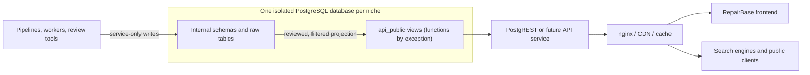

# RepairBase Public API Contract v1.0

**Status:** Conditional implementation approval

**Readiness:** Architecture approved; API direction approved; security
direction approved with defined implementation constraints. Implementation may
begin only when the readiness conditions in section 20 are resolved.

**Contract version:** 1.0.0

**Prepared:** 2026-08-02

**Applies to:** RepairBase public read APIs and all RepairBase niche frontends

**Implementation status:** Not implemented

> This document is a contract and migration target. It does not authorize or
> implement database objects, grants, RLS, frontend changes, deployment,
> sanitization, caching, or production access.

## 1. Purpose and scope

This contract creates a stable boundary between RepairBase's internal data and
public consumers. Frontends, search engines, caches, and future API clients may
depend only on the resources and fields defined here. They must not depend on
raw PostgreSQL tables, internal keys, pipeline state, or PostgREST-specific
implementation details.

The contract applies to the shared RepairBase codebase and to each separately
operated niche database, including Appliance, Marine, HVAC, Printer, and Coffee.
Each niche has its own PostgreSQL database, PostgREST instance, credentials,
backup, and runtime. Data is not shared between niches, and this contract does
not add a `vertical_id` to Appliance tables.

This is an explicit owner-approved architecture decision, not an alternative
under evaluation. Shared code includes frontend, backend, workers, pipelines,
migrations, AI, rendering, and deployment tooling; shared data does not.

In scope:

- anonymous read resources under the logical `api_public` API;
- resource identity, representation, relationships, publication, localization,
  pagination, errors, caching, SEO, security, and compatibility;
- a target contract that can be implemented first with PostgreSQL views and
  PostgREST and later by a service such as FastAPI;
- requirements for future migrations and contract tests.

Out of scope:

- writes from browsers or anonymous clients;
- authoring, scraping, AI generation, review, and worker APIs;
- authentication flows and private customer data;
- implementation of `api_public`, RLS, grants, views, sanitization, headers,
  Cloudflare rules, frontend query changes, or database migrations;
- cross-niche data access or multi-tenant rows in a shared database.

Future `api_public` migrations, frontend data-access work, HTML sanitization,
security hardening, and niche launches must conform to an approved version of
this document.

### Normative language

**MUST**, **MUST NOT**, **SHOULD**, **SHOULD NOT**, and **MAY** are normative.
Examples and current-state observations are non-normative unless explicitly
stated otherwise.

## 2. Definitions

| Term | Definition |
|---|---|
| Public API | The documented, read-only resources exposed to untrusted public clients. |
| Internal schema | All storage tables, pipeline objects, functions, columns, and identifiers not explicitly included in this contract. The current `public` PostgreSQL schema is internal despite its name. |
| Resource | A named collection with a stable meaning, fields, filters, and identity. |
| Representation | The JSON shape returned for one resource item. |
| Published content | Content that satisfies all relation, quality, safety, timing, and locale gates and is explicitly in the `published` state. |
| Draft content | Incomplete or unapproved content; never public. |
| Locale | A normalized BCP 47 language tag, lowercase language plus optional uppercase region, for example `en`, `sv`, or `en-GB`. |
| Canonical locale | The source locale for a niche, initially `en` unless a niche configuration explicitly says otherwise. |
| Stable identifier | An immutable public identifier whose meaning is not changed or reused when labels, slugs, or internal rows change. |
| Slug | A locale-aware, URL-safe routing label. It is mutable only through an alias/redirect process and is not an internal key. |
| API version | A declared compatibility boundary. v1 is contract version 1.x and the `api_public` major schema. |
| `anon` | An untrusted anonymous database/API role. It receives only approved read access. |
| `authenticated` | A signed-in end-user role. v1 grants it no broader public-content access by default. |
| `service_role` | A privileged server-only role used by controlled pipelines and services; never shipped to a browser. |
| Authenticator | The PostgREST connection role that switches to a request role. It is not itself a public data entitlement. |
| Cache class | A named freshness and invalidation policy assigned to a resource. |

## 3. Architecture boundary



The boundary rules are:

1. Internal tables are never part of the frontend contract.
2. `api_public` is a projection and policy boundary, not a storage schema.
3. PostgREST exposes only approved schemas. A future service must preserve the
   same representations and behavior even if its transport implementation differs.
4. nginx, Cloudflare, or another gateway may normalize errors, headers, URLs,
   and caching, but may not widen data access.
5. The frontend consumes only documented public resource names and fields.
6. Search engines see only canonical, indexable, published representations.
7. Workers and service-role clients operate on internal schemas and are not
   routed through anonymous public resources.

v1 uses views by default. A public function is allowed only when a documented
need cannot be solved safely and reasonably with views plus PostgREST filters.
Every public function requires a separate design/review covering purpose,
typed and allowlisted inputs, output schema, row cap, query cost, statement
timeout, fixed `search_path`, owner, invoker/definer mode, injection and dynamic
SQL risk, mutation capability, denial-of-service risk, cacheability, and
contract tests. Functions are never a shortcut around poorly designed views.

## 4. API versioning

### 4.1 v1 model

`api_public` is the stable public data boundary. The frontend and API are owned
and released by the same organization, so v1 does not require a URL version,
parallel PostgreSQL schema, version response header, or fixed deprecation
period. PostgREST schema/profile selection is an adapter detail, not a frontend
domain assumption.

Intentional breaking changes are normally delivered as one coordinated branch,
release, or ordered PR sequence that changes the projection, contract tests,
and frontend consumer together. The old and new query paths may coexist briefly
when needed for safe deployment and rollback, but there is no automatic
180-day or two-release support obligation.

Contract tests MUST stop unintentional breaking changes. Security-sensitive
fields or resources MAY be removed immediately, even when that breaks a client;
the remediation and client impact must be documented.

### 4.2 Breaking and compatible changes

A breaking change includes removing or renaming a resource/field, changing a
field type or meaning, making a nullable field required for clients, changing
identity, widening/narrowing publication semantics, changing locale fallback,
or changing default order in a way that alters pagination.

Backward-compatible changes include adding an optional field, adding a new
resource, adding an opt-in filter, or improving data without changing meaning.
Adding an enum value is compatible only when clients tolerate unknown values.

Deprecation remains useful when a coordinated cutover cannot be atomic: record
the replacement, usage evidence, cutover sequence, and removal point. Separate
major-version machinery such as `/api/v2`, `api_public_v2`, version headers, and
long parallel support is a future consideration for multiple independent
consumers or a frontend that cannot migrate in coordination.

## 5. Common API rules

| Concern | v1 rule |
|---|---|
| Resource names | Lowercase plural `snake_case`. |
| JSON fields | Lowercase `snake_case`; no internal table-qualified names. |
| Dates/times | RFC 3339 UTC strings with `Z`; dates use ISO 8601 `YYYY-MM-DD`. |
| Null | `null` means known absence/not applicable. Missing fields are not a substitute for null in a fixed v1 representation. |
| Booleans | JSON `true`/`false`, never `0`, `1`, or strings. |
| Numbers | JSON numbers in documented units. Precision-sensitive values use documented decimal semantics. |
| Enums | Lowercase `snake_case`; clients MUST handle unknown future values defensively. |
| Lists | Empty relationship/list results are `[]`, never `null`. |
| Identifiers | Public keys are immutable strings/UUIDs. Raw integer database IDs are not public unless explicitly declared. |
| Slugs | Lowercase URL-safe segments, unique within their documented scope; old published slugs require aliases/redirects. |
| Canonical URL | Returned as `canonical_path`, beginning with `/`, without origin, query, or fragment. |
| Timestamps | `published_at` and `updated_at` describe public lifecycle, not scrape or internal row timestamps. |
| Soft deletion | Deleted, archived, rejected, or unpublished records are absent from anonymous collections and return 404 by public identity. |
| Stable order | Every collection has a documented primary order and immutable tie-breaker. |

Only `published` records are visible. A raw status is never a request-controlled
filter for anonymous clients. Future-dated `published_at`, expired `unpublished_at`,
failed quality/safety checks, missing required relationships, or inactive parents
exclude a record.

All public external URLs (including manuals) require an approved URL status.
Validation runs at ingest where feasible, before proposal/publication, and in a
recurring link check. It permits HTTPS only; rejects `javascript:`, `data:`,
`file:`, localhost, loopback, link-local, private-network, and other forbidden
targets; normalizes hostnames; caps length; enforces an approved-host or
documented external-host policy; and validates every redirect plus final
destination against the same rules. Broken links and redirect loops are hidden.
Local paths never appear. A scraping source URL is not automatically an approved
public manual URL.

## 6. Public resources

The following tables define target JSON representations. `uuid` means a stable
public UUID, not the current integer primary key. Where the current schema lacks
one, implementation requires a migration or an approved immutable key mapping.

### 6.1 `api_public.brands`

Purpose: active manufacturer navigation and brand pages. Primary public
identifier: `brand_key` (immutable semantic key; initially compatible with the
current brand slug).

| Field | Type | Nullable | Meaning |
|---|---|---:|---|
| `brand_key` | string | no | Stable manufacturer key. |
| `slug` | string | no | Current URL slug. |
| `name` | string | no | Public display name. |
| `logo_url` | string | yes | Approved public logo URL. |
| `canonical_path` | string | no | Brand hub path. |
| `updated_at` | timestamp | yes | Last public-content change. |

- Relations: `models.brand_key`, `error_codes.brand_key`, `faults.brand_key`.
- Publication: active brand with at least one published public child.
- Default order: `name asc, brand_key asc`.
- Filters: `brand_key`, `slug`; list filter `brand_key`.
- Sort: `name`, `brand_key`.
- Locale: name is language-independent in v1.
- Cache: `reference`.
- Never expose: internal `id`, support/manual scrape sources, ManualsLib ID,
  scrape status, scrape timestamps, or internal creation timestamp.

### 6.2 `api_public.categories`

Purpose: localized category navigation. Primary public identifier:
`category_key + locale`.

| Field | Type | Nullable | Meaning |
|---|---|---:|---|
| `category_key` | string | no | Stable semantic key, for example `washing_machine`. |
| `locale` | locale | no | Representation locale. |
| `slug` | string | no | Locale-specific route slug. |
| `name` | string | no | Localized category name. |
| `icon_key` | string | yes | Stable frontend icon/config key, not an arbitrary database path. |
| `sort_order` | integer | no | Curated display order. |
| `canonical_path` | string | no | Localized category path. |
| `updated_at` | timestamp | yes | Last public-content change. |

- Relations: models, error codes, and faults use `category_key`.
- Publication: active category plus an approved translation for requested locale.
- Default order: `sort_order asc, category_key asc`.
- Filters: `category_key`, `locale`, `slug`.
- Sort: `sort_order`, `name`, `category_key`.
- Locale: no implicit row-level fallback; see section 9.
- Cache: `reference`.
- Never expose: internal category/translation IDs, `slug_en` storage naming,
  raw icon paths, or internal creation timestamps.

### 6.3 `api_public.models`

Purpose: model discovery, detail pages, series navigation, and sitemap records.
Primary public identifier: immutable `model_id` UUID. Route identity is the
tuple `brand_key + category_key + slug`.

| Field | Type | Nullable | Meaning |
|---|---|---:|---|
| `model_id` | uuid | no | Stable public model identity. |
| `brand_key` | string | no | Public brand relation. |
| `category_key` | string | no | Public category relation. |
| `product_line_key` | string | yes | Public product-line relation. |
| `name` | string | no | Public model name. |
| `slug` | string | no | Route slug within brand/category. |
| `series` | string | yes | Public model family label. |
| `release_year` | integer | yes | Four-digit year when verified. |
| `manual_url` | string | yes | Approved public manual landing/download URL. |
| `indexable` | boolean | no | SEO eligibility; existence alone is insufficient. |
| `updated_at` | timestamp | yes | Last public-content change. |

- Publication: active brand/category, valid route tuple, approved model; a raw
  scraped row is not automatically published.
- Default order: `name asc, model_id asc`.
- Filters: `model_id`, `brand_key`, `category_key`, `product_line_key`, `slug`,
  `series`; list filters for keys.
- Sort: `name`, `release_year`, `series`, `model_id`.
- Locale: core model fields are language-independent; paths combine localized
  category slug at rendering time or through sitemap resources.
- Cache: `catalog`.
- Never expose: internal integer IDs, `base_model`, local `manual_pdf_path`,
  scrape status/timestamps, raw source URLs, or internal creation timestamp.

### 6.4 `api_public.error_codes`

Purpose: safe, reviewed error-code summaries and navigation. Primary public
identifier: immutable `error_code_id` UUID; natural scoped key is
`brand_key + category_key + code`.

| Field | Type | Nullable | Meaning |
|---|---|---:|---|
| `error_code_id` | uuid | no | Stable public identity. |
| `brand_key` | string | no | Public brand relation. |
| `category_key` | string | no | Public category relation. |
| `code` | string | no | Manufacturer-displayed code. |
| `title` | string | no | Reviewed short description. |
| `description` | string | yes | Reviewed plain-text explanation. |
| `severity` | enum | no | Public severity taxonomy. |
| `diy_possible` | boolean | no | Reviewed safety guidance flag. |
| `article_id` | uuid | yes | Published article relation. |
| `canonical_path` | string | yes | Published article or code page path. |
| `updated_at` | timestamp | yes | Last public verification change. |

- Publication: explicit review/safety approval, active parents, nonempty code.
- Default order: normalized `code asc, error_code_id asc`.
- Filters: identity, brand/category keys, exact `code`, `severity`,
  `diy_possible`, `article_id`.
- Sort: `code`, `severity`, `updated_at`.
- Locale: v1 text is canonical-locale unless a localized code resource is
  introduced; clients must not label canonical text as translated.
- Cache: `content`.
- Never expose: raw OCR `display_text`, source URL, scrape status, internal IDs,
  verification workflow fields, or unreviewed descriptions.

### 6.5 `api_public.faults`

Purpose: localized symptom/fault listings and article navigation. Primary
public identifier: immutable `fault_id` UUID.

| Field | Type | Nullable | Meaning |
|---|---|---:|---|
| `fault_id` | uuid | no | Stable public identity. |
| `brand_key` | string | no | Public brand relation. |
| `category_key` | string | no | Public category relation. |
| `locale` | locale | no | Representation locale. |
| `slug` | string | no | Localized route slug; until localized slugs exist, approved canonical slug. |
| `name` | string | no | Localized symptom/fault name. |
| `meta_title` | string | yes | Approved SEO title. |
| `meta_description` | string | yes | Approved SEO description. |
| `severity` | enum | yes | Public severity. |
| `has_error_code` | boolean | no | Whether reviewed code relations exist. |
| `article_id` | uuid | yes | Published fault article. |
| `canonical_path` | string | no | Localized fault path. |
| `updated_at` | timestamp | yes | Last public-content change. |

- Publication: approved locale representation, active parents, and all safety
  gates. Missing translation means no row for that locale.
- Default order: `name asc, fault_id asc`.
- Filters: identity, brand/category, locale, slug, severity, `has_error_code`.
- Sort: `name`, `severity`, `updated_at`.
- Cache: `content`.
- Never expose: canonical/internal names used by pipelines, internal IDs,
  review notes, raw mapping rows, or timestamps unrelated to publication.

### 6.6 `api_public.articles`

Purpose: language-independent article identity and relationships. Primary
public identifier: immutable `article_id` UUID.

| Field | Type | Nullable | Meaning |
|---|---|---:|---|
| `article_id` | uuid | no | Stable public identity. |
| `article_type` | enum | no | `error_code` or `fault` in v1. |
| `error_code_id` | uuid | yes | Public relation for error-code articles. |
| `fault_id` | uuid | yes | Public relation for fault articles. |
| `canonical_locale` | locale | no | Source/canonical locale. |
| `published_at` | timestamp | no | First public availability. |
| `updated_at` | timestamp | no | Last material public change. |

- Exactly one of `error_code_id` and `fault_id` MUST match `article_type`.
- Publication: article state `published`, valid relation, publication window,
  and at least one publishable translation.
- Default order: `updated_at desc, article_id asc`.
- Filters: identity, type, public relation IDs, `canonical_locale`.
- Sort: `published_at`, `updated_at`, `article_id`.
- Cache: `content`.
- Never expose: internal integer IDs, author workflow ID, review flags, firmware
  workflow metadata, draft status, or internal creation timestamps.

### 6.7 `api_public.article_translations`

Purpose: localized, sanitized article content and SEO representation. Primary
public identifier: `article_id + locale`.

| Field | Type | Nullable | Content rule |
|---|---|---:|---|
| `article_id` | uuid | no | Public article relation. |
| `locale` | locale | no | Exact representation locale. |
| `slug` | string | no | Localized route slug. |
| `title` | string | no | Plain text title/meta title. |
| `meta_description` | string | no | Plain text. |
| `heading` | string | no | Plain text H1. |
| `quick_fix` | string | yes | Plain text. |
| `intro_html` | string | yes | Sanitized allowlist HTML only. |
| `causes` | array<object> | no | Validated structured content; text members are plain text. |
| `steps` | array<object> | no | Validated structured steps. |
| `faq` | array<object> | no | Validated question/answer content. |
| `affected_models` | array<object> | no | Validated public model references/text. |
| `parts` | array<object> | no | Validated public part descriptions; no affiliate/internal metadata unless separately approved. |
| `prevention_html` | string | yes | Sanitized allowlist HTML only. |
| `technician_html` | string | yes | Sanitized allowlist HTML only. |
| `canonical_path` | string | no | Localized canonical route. |
| `hreflang` | array<object> | no | Published locale/path pairs only. |
| `indexable` | boolean | no | Search index directive. |
| `published_at` | timestamp | no | Locale publication time. |
| `updated_at` | timestamp | no | Last material locale change. |

- Publication: parent article published; translation explicitly `published`;
  required SEO fields present; structured fields validate; all HTML sanitizer
  checks pass; safety/quality gates pass; publication time is active.
- Default order: `updated_at desc, article_id asc`.
- Filters: `article_id`, exact `locale`, exact `slug`, public relation filters
  exposed through the article resource; list filter for `article_id`.
- Sort: `published_at`, `updated_at`, `article_id`.
- Cache: `article`.
- Never expose: `translation_status`, translator/model identity, source locale
  workflow fields, raw unsanitized HTML, internal status, review comments,
  quality scores, prompts, proposal data, or raw JSON of unknown shape.

### 6.8 `api_public.model_specs`

Purpose: normalized public model specifications. Primary public identifier:
`model_id + spec_key`. This is the sole public source of model specs.

| Field | Type | Nullable | Meaning |
|---|---|---:|---|
| `model_id` | uuid | no | Public model relation. |
| `spec_key` | string | no | Stable machine key, for example `capacity`. |
| `label` | string | no | Localized display label. |
| `locale` | locale | no | Label/metadata locale. |
| `value_type` | enum | no | `string`, `integer`, `decimal`, or `boolean`. |
| `value_text` | string | yes | Populated only for `value_type = string`. |
| `value_integer` | integer | yes | Populated only for `value_type = integer`. |
| `value_decimal` | decimal | yes | Populated only for `value_type = decimal`. |
| `value_boolean` | boolean | yes | Populated only for `value_type = boolean`. |
| `unit` | string | yes | Canonical unit code, for example `kg`, `rpm`, `mm`, `dB`, `kWh`, or `L`. |
| `group_key` | string | no | Stable display grouping. |
| `sort_order` | integer | no | Order within group. |
| `updated_at` | timestamp | yes | Last approved public change. |

- Publication: parent model published, spec key registered, value type/unit
  valid, conflict resolved, and value approved.
- Default order: `group_key asc, sort_order asc, spec_key asc`.
- Filters: `model_id`, `spec_key`, `group_key`, `locale`; list filter for keys.
- Sort: `group_key`, `sort_order`, `spec_key`.
- Cache: `catalog`.
- Never expose: raw JSONB blob, scrape timestamp/source, unregistered keys,
  conflicting candidates, confidence/quality score, or pipeline metadata.

### 6.9 Supporting resources

The following supporting v1 resources are required to eliminate remaining raw
queries even though the eight resources above are the minimum domain set.

| Resource | Primary identity | Approved fields | Purpose |
|---|---|---|---|
| `api_public.product_lines` | `product_line_id` UUID | `product_line_id`, `brand_key`, `category_key`, `name`, `slug`, `canonical_path` | Stable model grouping. |
| `api_public.product_codes` | `product_code_id` UUID | `product_code_id`, `model_id`, `code`, `market` | Publicly needed verified codes only; never EAN/retailer/scrape fields by default. |
| `api_public.article_pages` | `article_id + locale` | Complete localized, sanitized article page representation | Primary article SSR read model; avoids article+translation requests/embeds. |
| `api_public.model_pages` | `model_id + locale` | Localized category slug, model slug, canonical path, hreflang, indexability, timestamps | Primary model SSR/routing read model. |
| `api_public.fault_pages` | `fault_id + locale` | Localized fault representation, relations, canonical path, hreflang, indexability, timestamps | Primary fault SSR read model when the core fault resource is insufficient. |
| `api_public.category_pages` | `category_key + locale` | Localized category, canonical path, hreflang, indexability, timestamps | Category SSR read model; may be the same physical view as localized categories if its contract is complete. |
| `api_public.sitemap_entries` | `sitemap_entry_id` | `sitemap_entry_id`, `content_type`, `public_content_id`, `locale`, `canonical_path`, `updated_at`, `hreflang`, `indexable` | Bounded sitemap generation without bulk raw-table scans. |

Domain resources describe stable entities; localized page projections describe
one renderable page per public identity plus locale. `article_pages` is the
recommended article-page SSR resource and contains article identity/type,
error-code or fault relation, locale, slug, title, meta description, heading,
safe content, canonical path, published hreflang, indexability, and public
timestamps. It avoids two requests, ambiguous FK embeds, N+1, duplicated locale
logic, and split cache ownership. Apply the same rule to model/fault/category
pages when the core resource cannot satisfy one SSR request.

The language-independent `models` resource has no complete localized canonical
path. `model_pages` provides a row per `model_id + locale` with `brand_key`,
`category_key`, localized category slug, model slug, `canonical_path`,
`hreflang`, `indexable`, `published_at`, and `updated_at`.

`sitemap_entries` is an early implementation priority. It returns only
published rows with `indexable = true`, precomputed `canonical_path`, locale,
content type, public `updated_at`, and either published hreflang relations or a
stable key to fetch them. Identity is immutable `sitemap_entry_id` (or an
equivalent immutable composite of `content_type + public_content_id + locale`),
not the mutable path. Default/keyset order is `canonical_path asc, locale asc,
sitemap_entry_id asc`. A path change moves sort position but not identity. It prevents
the frontend from scanning and joining roughly 47,500 models. Choose ordinary
view, materialized view, or maintained projection table only after the
performance sequence in section 15.

## 7. Relationships between resources

Public relationships use public fields only:

| Navigation | Public relation |
|---|---|
| brand → models | `models.brand_key = brands.brand_key` |
| category → models | `models.category_key = categories.category_key` |
| model → error codes | Query `error_codes` by model applicability resource/function when a reviewed model mapping exists; current brand/category inference is not a permanent semantic relation. |
| model → faults | Query `faults` by explicit applicability when available; brand/category is a documented compatibility approximation only. |
| model → articles | Through published error-code/fault relations or a future explicit `model_articles` resource. |
| model → specs | `model_specs.model_id = models.model_id` |
| article → translations | `article_translations.article_id = articles.article_id` |

PostgREST embeds MAY be supported only when their public relationship names and
cardinality are contract-tested. Clients MUST be able to use separate requests.
Expansions use a transport-neutral `include` concept with an allowlist; arbitrary
internal joins are forbidden. Collection expansions are capped and paginated.

N+1 is avoided with list filters, sitemap projections, bounded embeds, and
purpose-built read functions. Frontend must not first fetch internal integer IDs
and then manually resolve raw tables. The current numeric-ID lookup pattern is a
migration compatibility concern, not v1 contract behavior.

## 8. Publication model

The domain lifecycle is:

| Status | Meaning | Public? |
|---|---|---:|
| `draft` | Incomplete authoring state. | no |
| `proposed` | Generated/submitted, not reviewed. | no |
| `reviewed` | Human/approved process completed but not scheduled live. | no |
| `published` | All gates pass and publication window is active. | yes |
| `unpublished` | Explicitly removed from public access. | no |
| `archived` | Retained internally for history. | no |
| `rejected` | Failed review or policy. | no |

Internal enums may differ, but the public projection MUST implement these
semantics. Publication requires:

- explicit `published` state for the parent and locale representation;
- `published_at <= now()` and no active `unpublished_at <= now()`;
- complete required relationships and fields;
- active brand/category/model parents;
- unique route identity and no unresolved duplicate;
- passed safety, quality, structured-data, and HTML checks.

Scheduled rows remain absent until their publication time. Unpublishing removes
the row immediately from anonymous access and triggers cache purge; the route
then returns 404 or a deliberately managed 410/redirect. Incomplete translations
are absent, not partially exposed. Duplicate candidates and rejected content
remain internal.

Publication state alone is insufficient. A public projection conceptually
requires independent gates equivalent to:

```sql
publication_status = 'published'
AND sanitization_status = 'passed'
AND content_validation_status = 'passed'
AND safety_status = 'approved'
AND relationship_validation_status = 'passed'
AND published_at <= now()
AND (unpublished_at IS NULL OR unpublished_at > now())
```

Exact internal names may differ, but publication state, translation QA,
sanitization, structured validation, safety approval, relationship completeness,
timing, accessibility, and indexability remain separate signals. A published
page with `indexable = false` remains accessible unless another gate fails.

## 9. Language and localization

- Locale values use normalized BCP 47 tags. Existing `en` and `sv` comply.
- Canonical locale is configured per niche, initially `en` for Appliance.
- Language-independent fields include stable IDs/keys, manufacturer/model
  identity, verified numeric specs, and relationships.
- Language-dependent fields include titles, descriptions, headings, labels,
  article content, SEO metadata, and route slugs.
- A requested locale returns only that locale's approved representation.
- The API MUST NOT silently substitute canonical-locale text into a response
  labeled as another locale.
- Missing translation returns an empty collection or 404 for the localized
  identity. A client MAY make an explicit canonical-locale fallback request and
  MUST render the returned locale honestly.
- `hreflang` contains only published translations and their canonical paths.
- Slug uniqueness is scoped by resource, locale, and documented parent route.
- Changing a published slug requires an alias/redirect record and cache/sitemap
  update; old identifiers are not reused.

### Current Swedish decision

The feature frontend currently treats English `published` as public and Swedish
`published` plus `pending` as public. Dev contains 330 English published and 330
Swedish pending article translations; all 330 Swedish rows have slugs and can
produce URLs.

| Alternative | URL impact | SEO/quality impact | Migration and rollback |
|---|---|---|---|
| A. Continue selected `pending` machine translations | Preserves up to 330 current Swedish URLs. | Highest quality/safety ambiguity; status no longer means what it says. | Requires an explicit separate approval flag and safety gate; rollback hides flagged rows. |
| B. Require approved statuses and expose only final `published` in v1 | Hides all 330 current Swedish article URLs until reviewed/promoted. | Strongest contract and predictable indexing; temporary coverage loss. | Review/promote before frontend cutover; retain old raw API during compatibility window for rollback. |
| C. Sample QA and controlled promotion | Preserves all rows that pass automated checks and a representative human sample; failed rows remain absent. | Combines a strict public state with controlled recovery of Swedish coverage. Residual sampling risk is bounded by documented acceptance criteria and exclusions. | Run structure, sanitizer, and quality checks; human-review a representative sample for language, technical correctness, safety, and SEO; if criteria pass, promote approved rows in an auditable batch. Keep batch rollback and row exclusions. |

**Recommendation:** C, subject to the sample meeting documented acceptance
criteria. Record batch ID, criteria, reviewer/owner, timestamp, included rows,
excluded rows, and rollback data. Regardless of promotion process, v1 exposes
only `published`; `pending`, `auto`, and `reviewed` remain internal states. Do
not revoke the old raw-table path until promotion, URL inventory, parity, and
rollback checks are complete.

A passing sample never automatically approves all 330 rows. Every row first
passes required fields, structure, sanitizer, links, prohibited terms,
empty/broken sections, placeholders, source-language remnants, length outliers,
duplicate content, safety phrases, technical units, and error-code checks. Human
sampling is stratified by category, article type, source/translation batch,
risk, safety-critical versus normal DIY, article length, and available AI model
version. Safety-critical strata receive a higher sample rate or full manual
review. Only per-row passes in a batch meeting approved thresholds may be mass
promoted; flagged rows are excluded for separate review. Audit evidence includes
batch/source/model, criteria, sample design, reviewed/failing/excluded rows,
approver, timestamp, and rollback mapping.

Before cutover, inventory all Swedish URLs and check known indexing in Google
Search Console. For URLs that fail approval:

- temporarily unpublished but expected to return: keep migration tracking and
  avoid a permanent redirect; return 404 while absent unless a temporary
  compatibility route is explicitly approved;
- permanently removed with no equivalent: consider 410 after confirming the
  URL was actually public/indexed;
- clear semantically equivalent published English page: consider a deliberate
  redirect with locale/SEO review, not an automatic blanket redirect;
- never actually published or indexed: 404 is normally sufficient.

## 10. Model specs

`api_public.model_specs` is the only public specification source. The internal
`model_specs` JSONB table may remain the write model, but its blob is not the
public representation.

Observed dev state: 419 nonempty JSON objects, all objects, with ten keys:
`capacity_kg`, `spin_speed_rpm`, `energy_class`, `width_mm`, `height_mm`,
`depth_mm`, `noise_spinning_db`, `energy_consumption_kwh`,
`water_consumption_l`, and `door_type`. Values are numbers except
`energy_class` and `door_type`, which are strings. Migration 010 retains the
typed `washing_machine_specs` rollback table. `scrape_specs.py` writes a
one-object-per-model upsert and supports only the same ten fields today.

Target rules:

1. `spec_key` names the concept, not the unit (`capacity`, not `capacity_kg`).
2. Unit is a separate canonical code. Values are stored/returned in one
   documented canonical unit; display conversion belongs to a tested layer.
3. A registry defines key, value type, unit, validation range, group, order,
   locale labels, and applicable categories.
4. Unknown/unregistered keys never enter the public view.
5. Duplicate candidates are resolved internally by approved source priority,
   verification time, and quality; the API returns at most one value per
   `model_id + spec_key + locale`.
6. Conflicts are not silently last-write-wins. Unresolved values remain hidden.
7. Invalid or obsolete values are corrected internally, then caches are purged;
   provenance and old values remain internal.
8. Scrape timestamps, source URLs, confidence, and raw evidence are not public.

v1 uses typed value columns, not polymorphic JSON. Exactly one `value_*` field
MUST be non-null and match `value_type`; every other typed value field MUST be
null. The projection enforces the invariant and contract tests cover all four
types plus zero/multiple-value rejection. Frontend switches on `value_type` and
reads only the matching typed field, preserving SQL type strength.

Open implementation work includes a spec registry, public model IDs, locale
labels, validation, and deterministic conflict policy. No scraper is run by
this design.

## 11. Articles and HTML content

Plain-text-only fields are `title`, `meta_description`, `heading`, `quick_fix`,
all slugs/keys, and textual members of structured objects unless a member is
explicitly documented otherwise.

Only `intro_html`, `prevention_html`, and `technician_html` may contain HTML in
v1. HTML MUST be processed before publication by a future allowlist-based
sanitizer that validates elements, attributes, URI schemes, nesting, and size.
Scripts, event handlers, embedded frames, unsafe styles, forms, and unsafe URLs
are forbidden.

Unsanitized or sanitizer-version-stale content MUST be marked internally and
excluded from `api_public`. The public API does not expose an `is_safe` toggle
that clients can ignore: inclusion itself is the guarantee. Frontend MUST still
render defensively and MUST NOT assume raw internal HTML is safe. Sanitizer
implementation is outside this task.

Internal evidence (not normally public) MUST include equivalents of
`sanitization_status`, `sanitizer_policy_version`, `sanitized_at`,
`sanitized_content_hash`, and `source_content_hash`. Inclusion requires passed
status, a current or explicitly still-approved policy, sanitized hash matching
the published content version, unchanged source since sanitization, and passed
structured JSON validation. Tests cover changed source after sanitization,
stale policy, hash mismatch, failed/missing metadata, malicious HTML, and unsafe
links.

Structured JSON (`causes`, `steps`, `faq`, `affected_models`, `parts`) requires
versioned JSON schema validation and field allowlists before publication. Raw
JSONB is never passed through unchanged.

## 12. Filtering, sorting, and pagination

- Default page size: 50.
- Maximum public page size: 200; sitemap uses a separate controlled batch size.
- Large or changing collections use keyset pagination over their documented
  stable order. v1 does not require or define an opaque cursor.
- The response supplies the public continuation values from its last row. For
  `order=name.asc,model_id.asc`, the next request represents the predicate
  `name > last_name OR (name = last_name AND model_id > last_model_id)`.
  The exact PostgREST boolean/filter syntax is an implementation detail tested
  by the adapter.
- The immutable public identifier is always the final tie-breaker. Duplicate
  primary sort values therefore cannot skip or repeat rows.
- Nullable keyset fields require a documented fixed null order and an explicit
  null partition. Prefer non-null public sort projections for critical lists.
- Keyset continuation is a forward scan of the order observed at the previous
  page. Concurrent inserts/updates before the continuation boundary may not
  appear in that scan; clients requiring a consistent snapshot must restart or
  use a purpose-built snapshot/export resource. Deletions do not cause offset
  drift.
- Offset pagination is limited to small, administrative, or temporary
  compatibility flows. It is not the public strategy for models or sitemaps.
- Total count is opt-in (`count=exact`) because it may be expensive; absence is
  distinct from zero.
- Filters are allowlisted per resource. Supported abstract operators are exact
  match, list membership, bounded range for documented numeric/time fields,
  and explicit full-text `q` only on designated resources.
- Arbitrary column operators, wildcard projection, and arbitrary relationship
  traversal are not contract features.
- Sort syntax is an allowlisted field plus `asc`/`desc`.
- Every order appends the documented stable identifier as tie-breaker.
- Invalid continuation values, filter, sort, or size return a safe client error;
  values
  are never interpolated into raw SQL.

User-facing name keysets MUST use a documented fixed database collation or a
persisted normalized `sort_key`. Each keyset resource documents fields,
collation, Unicode normalization, case/accent sensitivity, null order, and
immutable tie-breaker. Acceptable choices are a fixed ICU collation, a persisted
normalized `sort_name`, or slug/key sorting where human alphabetization is not
required. Sitemaps prefer path sorting. Changing collation or sort-key semantics
is pagination-breaking and requires coordinated migration plus index rebuild.

`db-max-rows` is a PostgREST-wide cap independent of the resource contract. It
must be at least the largest allowed public batch or PostgREST may truncate a
valid response. A high global value does not authorize every resource to return
that many rows: per-resource limits must be enforced through approved views,
adapter validation, or request validation. An exceptional bounded sitemap
function requires the separate function review. Sitemap batches may need a
  separate bounded strategy. Range, count, and truncation behavior MUST be tested
against the deployed PostgREST configuration. Dev currently does not set
`PGRST_DB_MAX_ROWS` in Compose or the running container; its effective default
must be measured. Exact dev and production values remain an implementation
decision, and production must not be inspected as part of this design task.

Long sitemap generation MUST NOT rely on a fully live mutable scan. The
implementation must choose from a materialized snapshot with refresh version, a
stable public projection revision, or a defined export run with `generated_at`
or export ID, then paginate within that fixed dataset. Measurements determine
the choice. Tests mutate path, publish, and unpublish during a run and assert no
duplicates/missing entries plus deterministic rerun behavior.

## 13. Error contract

### Phase 1 — PostgREST implementation

Full response-body normalization is not a blocker for the first `api_public`
cutover provided sensitive data is not exposed. In phase 1:

- frontend never presents raw PostgREST/PostgreSQL messages to end users;
- frontend adapter maps known PostgREST status/error classes to safe internal
  frontend errors and generic user messages;
- client/server logging redacts credentials, connection strings, tokens,
  sensitive values, SQL, stack traces, and internal paths;
- public views and separately approved exceptional functions are designed so normal errors do not disclose internal
  rows, columns, constraints, or identifiers;
- nginx/gateway supplies generic status handling where safely possible, but
  ordinary nginx configuration is not assumed to rewrite arbitrary JSON bodies;
- raw SQL, credentials, stack traces, and sensitive payloads are never shown to
  end users.

Expected HTTP meanings remain 400 malformed request, 401 missing/invalid
authentication, 403 forbidden, 404 absent/unpublished/locale unavailable, 409
conflict, 422 semantically invalid input where the adapter can distinguish it,
429 rate limit, 500 unexpected failure, and 503 temporary unavailability.

### Phase 2 — normalized public errors

When FastAPI, an edge worker, an explicitly reviewed nginx extension, or another
gateway can transform response bodies, use this common format:

```json
{
  "code": "invalid_filter",
  "message": "The requested filter is not supported.",
  "request_id": null,
  "details": {}
}
```

`message` is safe for users. `details` is a bounded object/empty object and may
identify invalid public parameters, never SQL or internals. `request_id` is
optional/null until central correlation exists. Full normalization, request ID,
and correlation tests are later hardening, not permission to expose sensitive
phase-1 errors.

## 14. Security contract

Target privileges:

- `anon`: `USAGE` on `api_public`; `SELECT` only on approved views; no access to
  internal schemas/tables/sequences/functions. Any exceptional public function
  needs a separately allowlisted `EXECUTE` grant and the section 3 review.
- `authenticated`: same public reads by default; private features require a
  separate contract and least-privilege roles.
- `service_role`: server-only internal permissions required by controlled jobs;
  never exposed to browsers and not routed through anonymous credentials.
- authenticator: login/role-switch only; no direct data privilege beyond what
  PostgREST requires.

Approved public views normally use PostgreSQL's standard owner-rights behavior:
`anon` receives SELECT on the view but no privilege on its underlying tables.
The view owner, conventionally `api_public_owner`, MUST NOT be superuser, have
`BYPASSRLS`, own internal source tables, inherit `service_role`, hold broad write
privileges, have `CREATE` on internal or exposed schemas, or have more source
table/column privilege than each approved view requires. Internal tables SHOULD
be owned by a separate migration/database-owner role; `api_public_owner` MUST
not be that owner. It receives only explicit source SELECT required for approved
projections.

Where practical and materially useful, grant source access at column level:

```sql
GRANT SELECT (approved_column_1, approved_column_2)
ON internal_table TO api_public_owner;
```

Column grants are especially valuable when a table mixes public candidates with
raw HTML/JSON, prompts, source URLs, local paths, review comments,
quality/confidence, pipeline, or audit fields. They do not replace view field
allowlists, but reduce blast radius if a view is later edited incorrectly.
An overprivileged view owner can bypass intended row/column boundaries and turn
the view into a privilege-escalation surface.

PostgreSQL version MUST be verified before implementation. RLS behavior depends
on that version, view options, owner attributes, table ownership, and source
policies and MUST be deliberately documented and tested against the actual
version for every public view pattern. Consider `FORCE ROW LEVEL SECURITY` where
needed as defense in depth; never assume RLS automatically applies as intended
through an owner-rights view. `security_invoker` is used only when there is a conscious requirement for
the caller's table privileges and RLS context to apply; it is normally
incompatible with the target where `anon` has no underlying table access.
`security_definer` functions remain exceptional and require security review,
fixed `search_path`, constrained owner, no unsafe dynamic SQL, bounded inputs,
and dedicated tests. RLS remains defense in depth; neither view ownership nor
permissive raw policies may silently widen the contract.

### Immediate hardening vs staged migration

`scrape_jobs` and `schema_migrations` are not used by the inspected frontend.
Revoking `anon` and `authenticated` SELECT on those two tables is an urgent,
separate hardening candidate before full `api_public` migration. The change
needs its own narrowly scoped migration, access tests, dependency verification,
and rollback that restores only the prior grants if an unknown consumer is
proven. Other obviously internal tables should undergo the same dependency
audit; absence from current frontend code is necessary but not by itself proof
that no external consumer exists.

Raw tables still used by frontend follow the staged path: add `api_public`, add
views, migrate frontend, run parity tests, enforce publication in the database,
revoke raw access, then run negative access tests. Publication MUST NOT remain
only a client-side filter.

Never publicly accessible:

- `scrape_jobs` and worker queues;
- `schema_migrations` and migration metadata;
- raw scraping/source tables, raw payloads, parsed scrape JSON, and error logs;
- credentials, connection data, keys, and environment values;
- audit data and raw production backups;
- proposal/batch/apply/rollback artifacts;
- prompts, AI model/vendor metadata, and pipeline state;
- internal quality/confidence scores and review comments;
- local paths such as `manual_pdf_path`;
- unpublished translations/articles and internal status fields;
- raw author credentials or private metadata.

## 15. Projection-layer performance and indexing

Public projections may join localization, publication, relationship, and route
data during SSR after a cache miss. With about 47,500 models, a logically
correct view can still be operationally unsafe without measured plans.

### Projection choices

| Strategy | Benefits | Risks / appropriate evidence |
|---|---|---|
| Ordinary views | Simple, always current, low migration/refresh complexity. | Joins and path construction run per request; index-dependent; cache misses may have high latency. Start here for small reference resources and indexed detail lookups. |
| Materialized views | Fast reads; good for stable catalog/sitemap projections; can precompute paths and joins. | Refresh consistency/delay, refresh coordination, unique index requirement for `REFRESH MATERIALIZED VIEW CONCURRENTLY`, and cache alignment. |
| Stored/denormalized public fields or projection tables | Fast reads and simpler invalidation; useful for canonical paths. | Duplicate data, write-time complexity, stale values, and larger cascade/rollback surface. |

Recommended test order:

1. ordinary views for brands/categories and other small references;
2. ordinary indexed views for individual detail pages;
3. purpose-built or materialized `sitemap_entries` early;
4. `EXPLAIN (ANALYZE, BUFFERS)` and realistic cache-miss load tests;
5. materialize additional projections only when measurements justify it;
6. consider stored paths if category/locale path joins are a demonstrated
   bottleneck.

Measure p50/p95/p99 database latency, rows examined/returned, buffer hits/reads,
SSR total response time after CDN miss, sitemap batch time, host CPU/memory, and
materialized-view refresh duration/lock behavior. Test with production-like dev
cardinality, never against production.

### Required index categories

Migration design must identify and validate indexes for:

- publication status plus publication/unpublication time;
- brand/category/model and product-line relations;
- locale plus slug and scoped slug uniqueness;
- article plus locale/status/slug;
- every keyset primary sort plus immutable tie-breaker;
- `model_specs` per model and any approved spec-key projection;
- sitemap `indexable`, `canonical_path`, locale, and stable order;
- unique public UUIDs/semantic identifiers and aliases;
- unique materialized-view keys required for concurrent refresh.

Existing indexes are evidence, not automatic proof: for example models have
brand/category and scoped slug indexes, translations have locale/article/slug
indexes, and `model_specs` has model and JSONB indexes, but composite
publication/keyset patterns are not fully covered. Every proposed projection
requires `EXPLAIN (ANALYZE, BUFFERS)` in dev before rollout, including worst-case
filters and cold/warm cache behavior.

## 16. Cache contract

Cache layers are independent; purging one never implies another was purged:

| Layer | Key dimensions / owner | TTL and stale policy | Invalidation / relation |
|---|---|---|---|
| API projection cache | niche, projection revision, resource, locale, filters, sort/keyset; API/edge owner | Resource cache class; stale only for previously safe published data | Publication/projection event purges JSON; feeds SSR but does not purge SSR automatically. |
| SSR/page cache | niche host, locale, canonical path, render revision; frontend/edge owner | Page-specific TTL; stale safe page only | Content/path/navigation event purges rendered HTML and affected listing pages. |
| Sitemap cache | niche, export/refresh ID, sitemap index/batch; sitemap job/CDN owner | Stable for export lifetime | Projection refresh regenerates entries/index/batches then purges sitemap namespace. |
| Browser cache | URL plus safe vary dimensions; browser policy owned by serving layer | Short public API/page TTL; immutable assets separate | Cache headers/revalidation; cannot be actively relied on for immediate purge. |

An article change may require projection refresh, API response purge, SSR HTML
purge, sitemap entry update, sitemap batch purge, and category/brand listing
purge. The change-impact record names every layer and owner.

| Cache class | Examples | Suggested shared policy |
|---|---|---|
| `navigation` | homepage aggregates | `public, max-age=60, s-maxage=300, stale-while-revalidate=300` |
| `reference` | brands, categories | `public, max-age=300, s-maxage=3600, stale-while-revalidate=86400` |
| `catalog` | models, model specs | `public, max-age=300, s-maxage=3600, stale-while-revalidate=3600` |
| `content` | error codes, faults, model pages | `public, max-age=300, s-maxage=1800, stale-while-revalidate=3600` |
| `article` | article translations | `public, max-age=300, s-maxage=1800, stale-while-revalidate=3600` |
| `sitemap` | sitemap datasets | `public, max-age=300, s-maxage=3600, stale-while-revalidate=3600` |

Exact TTLs require load/SEO approval and Cloudflare verification. Responses
SHOULD provide strong or weak ETag based on public representation, or reliable
`Last-Modified`; conditional requests return 304. Cache keys include the active
contract/projection revision, niche host/database, resource, locale, filters,
sort, keyset continuation, and allowed expansions. They never include
secret-bearing headers.

Publication, correction, slug change, unpublish, and relationship changes emit
targeted purge events for resource, parents, sitemap, and relevant pages.
Unpublished/unsafe data must not remain stale-public: purge is synchronous or
the public projection must fail closed. `stale-if-error` is allowed only for
previously published safe content. This section changes no Cloudflare settings.

### Change impact and purge scope

Use targeted purge for bounded changes such as one article, model, spec, or SEO
description. Purge the resource, its known parent/list representations, and its
sitemap entry.

Use cascade/namespace purge for brand/category slugs, locale path prefixes, URL
structure, or routing rules. A category slug can affect its category page, all
model/fault/article paths, canonicals, hreflang, sitemaps, internal links, and
redirects. Changes affecting thousands of paths are not ordinary targeted
events.

Before a cascade change:

1. calculate and record the impacted resource/path count;
2. generate and validate aliases/redirects;
3. update or refresh every affected projection;
4. regenerate sitemap data;
5. purge the affected CDN namespace;
6. verify representative and boundary old/new URLs, canonical, and hreflang;
7. retain a tested rollback for data, projections, redirects, and cache state.

## 17. SEO-related fields

Frontend may rely on these API-owned fields where relevant:

- `canonical_path`;
- `title`, `meta_description`, and `heading`;
- locale-specific `slug` and `locale`;
- `hreflang` published locale/path pairs;
- `indexable`;
- `published_at` and `updated_at`;
- stable brand/category/model/code/fault relationships needed for structured data;
- verified model name, manufacturer name, code, severity, and spec values.

The API, not frontend knowledge of internal columns, determines canonical paths,
indexability, and localized alternates. Frontend combines `canonical_path` with
the configured site origin. Public resources must not emit a production origin
from another niche.

### Model-page indexability

`model exists` does not imply `model is indexable`. Dev has about 47,541 models,
but only 419 model-spec rows and 330 articles; this ratio signals risk, not proof
that every remaining model page is thin. `models.indexable` should be an
explicit or computed public decision based on approved minimum evidence such as
verified identity/unique route, unique useful content, specs, a manual, relevant
error codes/faults/articles, internal links, and absence of duplicate/canonical
conflicts.

Exact thresholds remain open pending distribution analysis: counts without
specs/manuals/error codes/articles, duplicate title/description analysis,
Google Search Console indexing evidence, and crawl/sitemap behavior. Thin or
duplicated model pages must support `indexable = false` without removing their
non-indexed navigation utility. `sitemap_entries` includes only
`indexable = true`.

`published = true, indexable = false` is valid: the accessible page normally
returns 200, carries `noindex` (or equivalent), stays out of sitemaps, may remain
in navigation, and may have a canonical. It is not 404 solely because it is not
indexable. Keep `published`, `accessible`, `indexable`, `in_sitemap`, and
canonical selection as distinct decisions; normally `in_sitemap` requires both
accessible and indexable.

## 18. Compatibility rules

| Change | Compatible within v1? | Rule |
|---|---:|---|
| Add nullable field | yes | Clients ignore unknown fields; document in minor release. |
| Add resource | yes | No change to existing semantics. |
| Add optional filter/sort | yes | Existing defaults unchanged. |
| Add enum value | conditional | Compatible for tolerant clients; otherwise coordinate the frontend change. |
| Make field more nullable | usually breaking | Coordinate projection/data/frontend handling. |
| Make nullable field required in response | compatible for readers, but data rollout required | Do not remove null handling until observed. |
| Change field type/units/meaning | breaking | Add a replacement or coordinate API and frontend atomically. |
| Rename/remove field/resource | breaking | Coordinate projection, tests, and frontend; optionally overlap for rollback. |
| Change identifier or reuse key | breaking/prohibited | Never reuse; provide a stable mapping and coordinated migration. |
| Change slug without alias | no | Alias/redirect required. |
| Change default ordering/tie-breaker | no | It invalidates pagination. |
| Change publication/fallback rule | no | Security/SEO semantics are contract behavior. |
| Tighten exposure for a security incident | permitted emergency break | Document incident and client mitigation; fail closed. |

For the controlled first-party frontend, breaking does not automatically mean a
new major version. It means the API projection, consumer, tests, deployment
sequence, and rollback must change together. Introduce separate schemas/routes
only when independent consumers or release constraints make coordination unsafe.

## 19. Test and validation requirements

### Blocking before first cutover

1. schema/resource/field/type/nullability and field allowlist snapshots;
2. forbidden fields and denial of `scrape_jobs`, `schema_migrations`, raw error
   logs, proposal data, unpublished translations, and every internal table;
3. `anon` can read approved views but cannot read source tables or write;
4. each view exposes no extra rows/columns; its owner is not superuser, lacks
   `BYPASSRLS`, does not own source tables, and has only required table/column
   SELECT; RLS behavior is explicitly tested for every public view pattern;
5. draft, proposed, reviewed, future, unpublished, archived, rejected,
   unsanitized, and structurally invalid content is absent;
6. exact locale, missing locale, slug alias, and published hreflang behavior;
7. stable keyset pagination, duplicate primary sorts, null order, page limits,
   `db-max-rows` truncation detection, range/count behavior, and changes between
   pages;
8. `sitemap_entries` contains only published/indexable paths and has stable
   keyset batching; path/publication changes during a run produce no missing or
   duplicate entries and a fixed snapshot/revision/export reruns deterministically;
9. sanitizer malicious-input corpus and structured JSON schema rejection;
10. frontend route/content/SEO/sitemap parity for critical routes;
11. service-role development writes still work internally without widening
    anonymous access.
12. typed model specs accept exactly one matching value column and reject type
    mismatch, zero values, multiple values, invalid units, and unregistered keys.

### Subsequent hardening

- normalized error-body/status matrix and request-ID correlation;
- advanced Cache-Control/ETag/Last-Modified/purge matrix;
- compatibility fixtures for multiple independent consumers and parallel major
  versions;
- expanded cache-key, materialized-refresh, and load/performance matrices.

Deferring these hardening items does not permit credential leakage, raw SQL or
stack traces to users, unsafe HTML, unpublished content, or internal-table
access.

Tests run only against the isolated dev database/PostgREST. No contract test
may infer production authorization from an environment value.

## 20. Open decisions

Implementation readiness is conditional on:

1. approving the exact owner/RLS/column-privilege pattern on the actual
   PostgreSQL version;
2. approving localized page projections and primary SSR resources;
3. approving the typed `model_specs` representation;
4. selecting sitemap stable identity plus snapshot/revision/export consistency;
5. mapping separate publication, QA, sanitizer, validation, safety,
   relationship, timing, accessibility, and indexability signals;
6. assigning API, SSR, sitemap, and browser cache ownership/invalidation;
7. approving the stratified Swedish QA and controlled-promotion plan.

| Decision | Status | Recommendation | Rationale | Implementation impact / required evidence |
|---|---|---|---|---|
| Public UUIDs vs immutable semantic/composite keys | Open | UUIDs for mutable content; semantic keys for brands/categories | Current integer IDs are internal; slugs can change. | Add/backfill public IDs and uniqueness tests; approve URL alias model. |
| Localized page projection set | Open approval | `article_pages` primary; add `model_pages`, `fault_pages`, and category page shape where needed | One SSR read avoids embeds/N+1 and local path logic. | Confirm exact fields and cache ownership per page type. |
| Sitemap consistency strategy | Open, performance evidence required | Immutable entry ID plus materialized snapshot, projection revision, or export run | Live mutable keyset can miss/duplicate moved paths. | Benchmark and select before foundation implementation. |
| Exact model-to-error-code applicability | Open | Add explicit public mapping; do not enshrine brand/category inference | Current frontend returns all codes in a brand/category. | Data-quality audit and mapping design. |
| Exact model-to-fault applicability | Open | Add explicit mapping when evidence exists | Current relation is only brand/category. | Coverage analysis and fallback UX decision. |
| Swedish QA and controlled promotion | Recommended, owner approval required | Automated checks plus representative human sample, then audited promotion of approved rows | Preserves strict `published` API semantics while recovering qualified URLs. | Acceptance criteria, URL/GSC inventory, batch audit and rollback. |
| Sanitizer and structured-content schemas | Open/critical | Allowlist sanitizer plus versioned JSON schemas, fail closed | Current HTML/JSON can be returned raw. | Choose library/policy and build malicious-input tests. |
| Public views with constrained owner rights | Proposed | Dedicated least-privilege owner; `anon` reads views only | Standard owner-rights views support denied source-table access. | Role/grant/RLS design and privilege tests. |
| Keyset pagination for large collections | Proposed | Stable public sort plus immutable tie-breaker | Implementable through PostgREST filters and avoids offset drift. | Adapter expressions, null policy, index and mutation tests. |
| `sitemap_entries` early priority | Proposed | Implement in foundation phase | Eliminates frontend scans across about 47,500 models. | Compare view/materialized/projection plans and batching. |
| Exact `db-max-rows` values | Open | Set/test at least largest approved batch, with lower resource-level limits | Dev does not explicitly configure it. | Measure effective dev default; approve deployment values without inspecting production in this task. |
| View/materialization strategy | Open, performance evidence required | Start with ordinary indexed views; materialize sitemap first if justified | Correct choice depends on query plans, SSR miss latency and refresh cost. | EXPLAIN/BUFFERS, load and refresh measurements. |
| Model-page indexability criteria | Open, SEO analysis required | Explicit/computed `indexable`; sitemap only true rows | Model existence does not prove sufficient unique content. | Content distribution, duplicate analysis, GSC and crawl evidence. |
| Full normalized error gateway | Deferred hardening | Safe PostgREST adapter first, normalization when body-transforming layer exists | Ordinary nginx does not generally normalize JSON bodies. | Choose FastAPI/worker/reviewed gateway later. |
| Full external API versioning machinery | Deferred | Coordinated first-party v1 releases | One controlled consumer does not justify parallel major infrastructure. | Revisit with independent consumers or uncoordinated releases. |
| Spec registry and localized labels | Open | Versioned internal registry projected as rows | Current JSONB contains keys/units in field names only. | Approve keys, units, validation ranges, labels, groups. |
| Typed model-spec values | Recommended v1 decision | Exactly one typed value column matches `value_type` | Strong SQL/API typing. | Approve DDL/view invariant and frontend union handling. |
| Product-code public fields | Open | Expose only code/market when verified | EAN and retailer URLs may have quality/commercial concerns. | Product/SEO/privacy review. |
| Cache TTL and purge ownership | Open | Start conservative; publication event owns purge | Current Cloudflare behavior was not changed or tested here. | Dev/staging header and purge tests. |
| Exact titled “RepairBase Platform Architecture v1.0” source | Documentation gap, not architecture blocker | Create or reconcile later | Owner has now explicitly approved the architecture. | Preserve a canonical architecture document when available. |

The owner decision is explicit: shared reusable code and one isolated PostgreSQL
database, PostgREST instance, credential set, backup/restore process, and runtime
configuration per niche; no shared niche data and no general Appliance
`vertical_id`.

## 21. Implementation order after approval

### Step 0 — immediate risk reduction

1. Reconfirm no frontend use of `scrape_jobs` or `schema_migrations`.
2. Prepare a separate migration revoking public SELECT on those tables.
3. Add negative access tests and a grant-only rollback.
4. Rotate leaked Marine credentials as a separate security task.

### Step 1 — minimal public API foundation

1. Approve this revised contract and critical decisions.
2. Define the constrained view-owner role and verify RLS behavior.
3. Create `api_public` in dev.
4. Implement brands, categories, and `sitemap_entries` first.
5. Add blocking contract tests.
6. Measure with `EXPLAIN (ANALYZE, BUFFERS)` and cache-miss load tests.

### Step 2 — content and publication

1. Implement article and article-translation projections.
2. Enforce publication in the database projection.
3. Implement sanitizer and structured-content schemas.
4. Run Swedish automated checks and representative human QA.
5. Promote approved Swedish rows to `published` in an auditable batch.

### Step 3 — catalog

1. Implement models, faults, error codes, and normalized model specs.
2. Add/backfill public identifiers and aliases.
3. Implement and index keyset pagination.
4. Measure projection and SSR-miss performance.
5. Materialize only where evidence justifies refresh complexity.

### Step 4 — frontend cutover

1. Migrate frontend through a reversible adapter.
2. Run route, content, SEO, and sitemap parity.
3. Verify model-page indexability and crawl rules.
4. Verify Cloudflare MISS-to-HIT behavior in the approved environment.
5. Revoke remaining raw-table access after parity.
6. Run all negative access and privilege-boundary tests.

### Step 5 — later hardening

1. Add normalized gateway error bodies.
2. Add request IDs and central log correlation.
3. Introduce advanced API versioning only when consumers require it.
4. Add further cache/materialization optimization from measurements.

Avoid a flag day: add projections, test, migrate, verify parity, then revoke.
No item above is implemented by this document.

---

# Appendix A — Current-state inventory (dev, 2026-08-02)

## A.1 Evidence and limits

Inspected:

- backend branch `design/public-api-contract-v1`, based on stabilization SHA
  `a711087855b3a5271945e5069bc0aa0e76cc726d`;
- frontend remote feature ref `feature/frontend-multisite-foundation` at
  `ecbfd31c0d9a6efc3f18c219ed678dbc5541187f` without changing its checkout;
- backend docs, `db/schema.sql`, migrations through 010,
  `pipeline/scrape_specs.py`, frontend `src/lib/queries.ts`, direct page queries,
  Supabase client, and sitemap code;
- PostgreSQL catalogs and SELECT counts inside an explicit read-only transaction
  against `repairbase-dev-postgres` / `repair_appliance_dev`.

No production connection or mutation was used. The exact document titled
“RepairBase Platform Architecture v1.0” was not present in either inspected
repository/ref. That is a documentation gap, not a decision gap. The owner has
now explicitly approved shared reusable code plus one PostgreSQL database,
PostgREST instance, credential set, backup/restore process, and runtime
configuration per niche, with no shared niche data and no general Appliance
`vertical_id`. Existing VPS/foundation docs are consistent with that decision.

Dev PostgREST does not declare `PGRST_DB_MAX_ROWS` in Compose or the running
container environment. Its effective default and truncation behavior were not
assumed and must be measured in implementation tests. Production configuration
was not inspected.

## A.2 Current database objects

Dev exposes 24 ordinary tables in schema `public`; no application views were
present in the inspected catalog:

`article_translations`, `articles`, `authors`, `brands`, `categories`,
`category_translations`, `error_code_parts`, `error_code_product_codes`,
`error_code_symptoms`, `error_codes`, `fault_error_code_map`,
`fault_translations`, `faults`, `locales`, `model_specs`, `models`, `parts`,
`product_codes`, `product_lines`, `schema_migrations`, `scrape_jobs`,
`symptom_translations`, `symptoms`, and `washing_machine_specs`.

All 24 have RLS enabled but also have a permissive SELECT policy with
`USING (true)` for `public`; `anon` and `authenticated` have SELECT on all 24.
This includes raw scrape payloads/error logs in `scrape_jobs`, migration history,
internal statuses, raw article HTML/JSON, source URLs, local paths, and pipeline
metadata. `service_role` has broad table privileges, as expected for current
workers but requiring least-privilege review later.

### Planned exposure classification for all current tables

`frontend reference` means an actual current raw Supabase table query in the
inspected feature ref, not a comment, type name, or similarly named JSON field.
Backend evidence is repository Python usage; unknown external consumers still
require verification.

| Table | Class | Frontend reference | Known server/worker use | Anon now | Recommended immediate action | Dependency verification | Target after `api_public` |
|---|---|---:|---:|---:|---|---:|---|
| `article_translations` | `frontend_required_now` | yes | yes | yes | retain until page projection parity | yes | no raw anon; `article_pages`/approved views |
| `articles` | `frontend_required_now` | yes | yes | yes | retain until page projection parity | yes | no raw anon; approved views |
| `authors` | `unknown_dependency` | no | no repo evidence | yes | inventory external use before revoke | yes | no raw anon; add public author view only if approved |
| `brands` | `frontend_required_now` | yes | yes | yes | retain until brands-view parity | yes | no raw anon; `brands` view |
| `categories` | `frontend_required_now` | yes | yes | yes | retain until category parity | yes | no raw anon; category/page view |
| `category_translations` | `frontend_required_now` | yes | no Python evidence | yes | retain until localized parity | yes | no raw anon; localized view |
| `error_code_parts` | `unknown_dependency` | no | no repo evidence | yes | dependency audit; early-revoke candidate only after proof | yes | no raw anon |
| `error_code_product_codes` | `server_only` | no | yes | yes | audit external use, then revoke public read | yes | internal; approved projection if needed |
| `error_code_symptoms` | `unknown_dependency` | no | no repo evidence | yes | dependency audit; early-revoke candidate only after proof | yes | no raw anon |
| `error_codes` | `frontend_required_now` | yes | yes | yes | retain until error-code parity | yes | no raw anon; approved view/page relations |
| `fault_error_code_map` | `frontend_required_now` | yes | yes | yes | retain until relation parity | yes | no raw anon; approved relation projection |
| `fault_translations` | `frontend_required_now` | yes | yes | yes | retain until fault-page parity | yes | no raw anon; `fault_pages` |
| `faults` | `frontend_required_now` | yes | yes | yes | retain until fault parity | yes | no raw anon; approved views |
| `locales` | `server_only` | no | yes | yes | audit consumers; public locale list only through approved view if needed | yes | no raw anon |
| `model_specs` | `frontend_required_now` | yes | yes | yes | retain until normalized spec parity | yes | no raw anon; normalized `model_specs` view |
| `models` | `frontend_required_now` | yes | yes | yes | retain until model/page parity | yes | no raw anon; `models`/`model_pages` |
| `parts` | `server_only` | no direct table query | yes | yes | audit consumers; do not expose affiliate/internal fields | yes | no raw anon; optional approved view |
| `product_codes` | `server_only` | no | yes | yes | audit consumers before revoke | yes | no raw anon; optional restricted view |
| `product_lines` | `server_only` | no | yes | yes | audit consumers before revoke | yes | no raw anon; optional approved view |
| `schema_migrations` | `server_only` | no | migration runner | yes | first security-PR revoke candidate | yes | no public access |
| `scrape_jobs` | `server_only` | no | yes | yes | first security-PR revoke candidate | yes | no public access |
| `symptom_translations` | `unknown_dependency` | no | no repo evidence | yes | dependency audit; early-revoke candidate only after proof | yes | no raw anon |
| `symptoms` | `server_only` | no | yes | yes | audit consumers before revoke | yes | no raw anon; optional approved view |
| `washing_machine_specs` | `unused_or_legacy` | no actual query | legacy rollback table | yes | verify rollback dependency, then revoke public read | yes | no public access; retire separately |

Classification does not authorize revocation. Track A must preserve worker/service
access and prove each anonymous/authenticated revoke independently.

Current relevant row counts:

| Object | Rows |
|---|---:|
| brands | 12 |
| categories | 7 |
| category translations | 14 |
| models | 47,541 |
| product lines | 940 |
| product codes | 4,563 |
| error codes | 286 |
| faults | 111 |
| fault translations | 222 |
| articles | 330 |
| article translations | 660 |
| model specs | 419 |

All 330 articles have internal status `published`. English has 330 translation
rows with status `published`; Swedish has 330 with status `pending`. Current
policies do not enforce either status.

## A.3 Current frontend dependencies

The frontend initializes an untyped Supabase client from public environment
variables and queries raw objects directly. `src/lib/queries.ts` and page/sitemap
code currently depend on:

- `brands`: `id`, `name`, `slug`, `logo_url`, `is_active`;
- `categories`: `id`, `slug_en`;
- `category_translations`: `category_id`, `locale`, `name`, `slug`;
- `models`: `id`, `brand_id`, `category_id`, `name`, `slug`, `series`,
  `release_year`, `manual_url`, `manual_pdf_url`;
- `error_codes`: `id`, `brand_id`, `category_id`, `code`,
  `short_description`, `display_text`, `description`, `severity`, `diy_possible`;
- `faults`: `id`, `brand_id`, `category_id`, `slug`, `severity`,
  `has_error_code`;
- `fault_translations`: `symptom_name`, `meta_description`, `locale`;
- `fault_error_code_map` and embedded error-code/article relations;
- `articles`: `id`, `article_type`, `error_code_id`/`fault_id` through embeds;
- `article_translations`: slug/SEO/content JSON/HTML/timestamps and internal
  `translation_status` used as a client-side publication gate;
- `model_specs`: raw `specs` JSONB;
- direct bulk scans for model and sitemap path construction.

The frontend resolves internal numeric IDs, assumes PostgREST FK embed names,
performs multi-request joins, uses 1,000-row offset loops for about 47,500 models,
and logs raw query errors. Numeric category IDs also feed frontend/site config
logic even though the foundation document says they are not safe long-term
cross-layer identities.

Current relation gaps are visible in defensive code: model error codes are
approximated by brand/category, fault/article relationships sometimes avoid
embeds because PostgREST relationships may not be registered, and sitemap code
constructs locale paths from several raw tables.

Performance-critical current patterns are model lists ordered by name, scoped
brand/category lookups, locale+slug translation lookups, article+locale/status,
model specs by model, and sitemap scans across models plus path joins. Large
model and sitemap flows require keyset order and matching composite indexes.
Likely critical projections are `models`, localized articles/faults, and
especially `sitemap_entries`; ordinary versus materialized implementation needs
measured plans and cache-miss latency.

## A.4 Current security and quality risks

1. **Critical:** anonymous SELECT on `scrape_jobs` exposes `source_url`,
   `raw_data`, `parsed_json`, and `error_log`.
2. **Critical:** anonymous SELECT on `schema_migrations` exposes internal
   migration metadata.
3. **Critical:** permissive raw article/translation reads bypass application
   publication filters and can expose unpublished/unsafe fields directly.
4. **Critical:** no verified allowlist sanitizer gate exists between stored HTML
   and anonymous reads.
5. **High:** raw tables expose internal IDs, statuses, source/pipeline fields,
   local paths, and unapproved columns.
6. **High:** frontend publication behavior treats Swedish `pending` as public;
   database policy does not enforce publication at all.
7. **High:** public errors are not normalized and may reveal PostgREST/PostgreSQL
   implementation details.
8. **High:** frontend depends on internal FK/embed names and numeric IDs.
9. **Medium:** offset bulk pagination can drift and creates expensive sitemap
   queries.
10. **Medium:** raw JSONB specs have no public registry, labels, units, or
    validation contract.

The inspected frontend contains no queries to `scrape_jobs` or
`schema_migrations`. They are candidates for immediate public-grant revocation
before full migration, subject to a separate dependency check, migration,
negative access test, and rollback. Other internal tables require the same
audit rather than assumption.

## A.5 Breaking-change risks

- Revoking raw-table SELECT before frontend migration breaks all current data pages.
- Strict publication would remove up to 330 Swedish article URLs immediately.
- Replacing integer IDs without a mapping breaks helper queries and page code.
- Renaming PostgREST relationships breaks embedded selects.
- Normalizing model specs changes the current raw object shape.
- Changing default sorting or pagination while generating routes can add/drop pages.
- Introducing sanitizer gates may hide content until reprocessed.
- Switching schemas without a compatibility adapter can fail every frontend request.

## A.6 Recommended migration sequence

Add `api_public` and stable IDs/keys without revoking anything; implement views
and contract tests; resolve Swedish publication and sanitizer blockers; add a
frontend adapter and migrate query groups; run route/content/sitemap parity;
then revoke `anon` raw access in dev and prove negative access. Only after an
approved production plan should the same sequence be considered outside dev.

---

# Appendix B — Decision log

| Decision | Status | Recommendation | Rationale | Implementation impact |
|---|---|---|---|---|
| One PostgreSQL database per niche | Approved | Keep separate database/PostgREST/credentials/backup/runtime per niche. | Strong isolation; no cross-niche rows. | Repeat migrations/contract tests per database. |
| Shared reusable codebase | Approved | Reuse frontend/backend/workers/pipelines/migrations/AI/render/deployment tooling. | Reuse without data coupling. | Configuration selects endpoint/niche, not row tenant. |
| No general `vertical_id` in Appliance | Approved | Keep | Separate databases provide isolation. | Do not introduce tenant-column assumptions. |
| `api_public` as frontend boundary | Proposed for implementation | Frontend reads approved public objects only. | Decouples frontend and protects internals. | Views, grants, PostgREST schema, frontend adapter. |
| Public views using constrained owner rights | Proposed | Dedicated least-privilege owner, no source access for `anon`. | Correct PostgreSQL privilege boundary. | Role/grant/RLS design and tests. |
| Full external API versioning machinery | Deferred | Coordinate first-party API/frontend v1 changes. | One controlled consumer does not require parallel major infrastructure. | Revisit with independent consumers. |
| Anonymous writes | Decided | None | Public site is read-only. | Revoke all non-SELECT public privileges. |
| Public identity | Open | UUID for mutable entities; semantic keys for brand/category | Avoid internal integers and mutable slugs. | Backfill/mapping migration. |
| Publication state | Proposed | Only explicit `published` | Fail-closed and auditable. | Move gate into projection. |
| Swedish QA and controlled promotion | Recommended, owner approval required | Automated checks plus sample QA and audited mass promotion. | Preserve qualified URLs without publishing `pending`. | Criteria, GSC/URL inventory, batch log, rollback. |
| Locale fallback | Proposed | Explicit request, never mislabeled implicit fallback | SEO/content correctness. | Frontend fallback UX and 404 handling. |
| HTML | Proposed critical gate | Allowlist-sanitized before inclusion | Prevent stored XSS/unsafe links. | Sanitizer/version fields and tests. |
| Specs | Proposed | Normalized public rows from internal JSONB | Stable labels/types/units. | Registry/projection and frontend migration. |
| Keyset pagination for large collections | Proposed | Stable sort and immutable tie-breaker. | Implementable with PostgREST and avoids offset drift. | Adapter/index/null/concurrency tests. |
| `sitemap_entries` as early implementation priority | Proposed | Implement with brands/categories in foundation. | Avoid frontend bulk path joins. | Performance-tested view/materialized/projection choice. |
| Full normalized error gateway | Deferred hardening | Safe PostgREST adapter first. | Body transformation component does not yet exist. | Later gateway/worker/FastAPI decision. |
| Model-page indexability criteria | Open, SEO analysis required | Explicit/computed `indexable`. | Existing model does not prove valuable indexable page. | Distribution, duplicates, GSC/crawl evidence. |
| View/materialization strategy | Open, performance evidence required | Start ordinary; materialize from evidence. | Trade-off is workload-specific. | EXPLAIN/load/refresh measurements. |
| Cache | Open detail | Named classes plus event purge | Safe freshness and predictable SEO. | Header/purge implementation and tests. |

---

# Appendix C — Gap analysis

| Priority | Current state | Target v1 | Required remediation |
|---|---|---|---|
| Critical | `anon` reads `scrape_jobs`. | Internal scrape payloads/logs are inaccessible. | Immediate scoped revoke candidate plus negative test/rollback. |
| Critical | `anon` reads `schema_migrations`. | Migration metadata is inaccessible. | Immediate scoped revoke candidate plus negative test/rollback. |
| Critical | `anon` reads every other raw table. | `anon` reads approved `api_public` views only. | Add views/tests, migrate frontend, revoke raw grants/policies. |
| Critical | Raw HTML/JSON can be selected without sanitizer/shape gate. | Only allowlist-sanitized HTML and validated structures are included. | Sanitizer, schema validation, fail-closed view predicate. |
| Critical | Publication is a frontend filter; raw API bypasses it. | Publication is enforced by the API projection. | Add lifecycle fields/rules and negative tests. |
| Critical | `security_invoker` with denied source-table access would fail the intended view model. | Constrained owner-rights views; deliberate RLS behavior. | Dedicated owner/grants and privilege/RLS contract tests. |
| High | Swedish `pending` is rendered (330 URLs). | Only explicit `published` is public. | Owner decision, review/promotion, parity/SEO rollback plan. |
| High | Frontend knows raw table/column/FK names. | Frontend knows only contract resources. | Data adapter and staged query migration. |
| High | Internal numeric IDs cross the boundary. | Stable public UUIDs/semantic keys. | Add/backfill IDs/keys and mappings. |
| High | Projection performance has not been measured for joins and 47,500 models. | Evidence-based ordinary/materialized/stored strategy. | EXPLAIN/BUFFERS, SSR miss load and refresh tests. |
| High | Slug/path changes can cascade across tens of thousands of cached URLs. | Impact-counted namespace purge and redirects. | Cascade plan, projection refresh, sitemap, CDN and rollback tests. |
| High | Model pages have no explicit indexability criteria. | `indexable` reflects approved content/duplicate evidence. | Content distribution, duplicate and GSC/crawl analysis. |
| High | Model-to-error/fault semantics are inferred by brand/category. | Explicit documented applicability. | Data model/evidence review and mapping resources. |
| Medium | `model_specs.specs` is raw JSONB with unit-bearing keys. | Registered normalized rows with labels/types/units. | Spec registry, validation, projection. |
| Medium | Bulk offset scans build routes/sitemaps. | Keyset batches and early `sitemap_entries`. | Stable sort/tie-breaker, indexes and performance tests. |
| Medium | PostgREST `db-max-rows` is not explicitly set in dev. | Server cap and resource limits are aligned/tested. | Measure default, choose values, detect truncation. |
| Medium | Cache behavior is not part of the data contract. | Named cache classes, validators, purge rules. | Dev/staging header and invalidation implementation. |
| Medium | Full error-body normalization is unavailable. | Safe phase-1 adapter; normalized phase 2. | Defer gateway format while preserving redaction. |
| Medium | External major-version machinery is oversized for one controlled consumer. | Coordinated v1 changes. | Defer parallel versions/headers until needed. |
| Medium | Current schema lacks complete public lifecycle timestamps/aliases. | Stable publication and slug lifecycle. | Add public lifecycle/alias representation. |
| Low | Exact canonical architecture document is missing. | Owner-approved architecture is recorded canonically. | Documentation follow-up; not an architecture blocker. |

---

# Final recommended implementation tracks after approval

## Track A — Security hardening PR

Strict scope:

1. dependency scan of all 24 tables, including external/worker consumers;
2. revoke `anon` and `authenticated` only from verified internal tables;
3. begin with `scrape_jobs` and `schema_migrations`;
4. identify additional safe revoke candidates from Appendix A;
5. add negative access tests and preserve worker/service access;
6. no frontend migration and no `api_public` implementation;
7. grant-only rollback restoring exactly previous privileges;
8. Marine credential rotation remains a separate credential task.

## Track B — Public API foundation PR

Strict scope:

1. create `api_public` in dev;
2. create constrained `api_public_owner` with approved table/column grants;
3. implement `brands`;
4. implement localized categories or the approved category page projection;
5. implement snapshot/revision/export-consistent `sitemap_entries`;
6. add immutable public identities;
7. implement documented-collation keyset pagination;
8. add required indexes;
9. add blocking contract/privilege/RLS tests;
10. record `EXPLAIN (ANALYZE, BUFFERS)` and cache-miss performance.

Do not implement all resources in the foundation PR. Articles/page content,
models, faults, error codes, and typed model specs belong in later bounded PRs.
