# ApplianceRepairBase Information Model v1

Status: **normative**

Decision date: 2026-08-03

Scope: ApplianceRepairBase only

Documentation base: `appliance-db` `74fc362` (`main`/local `origin/main`)

Frontend reference: `appliance-theme` `ed0128a`

This document freezes the domain model and migration invariants for version 1. “MUST”, “MUST NOT”, and the declarative schema definitions are normative. No schema or runtime change is made by this specification.

## 1. Evidence and current-state boundary

Available source material:

- `appliance-db` schema and migrations 002–008 on the documentation base;
- pending branch `feature/public-api-models`, including migration 010 and security work;
- uncommitted schema/migration work in the original `codex/article-content-expansion` worktree, inspected read-only;
- `appliance-theme/src/lib/queries.ts` and its model/article/fault routes;
- `docs/worker-platform-discovery.md` from commit `d12322d`;
- the previously documented read-only deployed-schema counts in the task context.

Unavailable material is `not_available`: no separate Claude/Claude Code artifacts were supplied. Spec 0 made no external or production request.

The sources disagree in these known ways:

| Area | `main` at `74fc362` | Later local/branch material | Previously verified deployed state |
|---|---|---|---|
| Locales/category translations | Not in baseline schema | Present in consolidated pending schema | Present |
| Fault domain | Migrations 007 | Consolidated into pending schema | Present |
| Specifications | `washing_machine_specs` in migration 008 | `model_specs(model_id, specs, scraped_at, created_at)` in pending migration 010 | Both tables present; 419 rows each |
| Parts/symptoms/authors | Absent from baseline | Present in pending consolidated schema | Tables present but parts/symptoms empty |
| Public models API/security | Absent | Pending feature branch | Not reverified in Spec 0 |

The verified counts retained as context are 47,663 models, 4,644 product codes, 286 error codes, 111 faults, 330 articles, 5,856 error-code/product-code links, and 419 generic model-spec rows. They are observations, not migration preconditions.

Frontend behavior at `ed0128a` is authoritative for compatibility: model URLs are derived from category/brand/model slugs; model pages currently load every fault and error code in the model’s brand/category; related models use `models.series`; `model_specs` is read as JSONB; article publication is locale-sensitive; sitemap membership and renderability are separate queries.

## 2. Fixed domain decisions

The v1 content cube is the set of existing active brands × existing categories × existing locales. V1 adds no scope dimension and no other RepairBase vertical.

Brand and Category are independent. `categories.brand_id` MUST NOT exist. Model is the canonical structured main model. Model Variant is a market, region, revision, or configuration variant below Model. Product Code is an exact manufacturer, commerce, catalog, retailer, or service identifier. Product Line and `models.series` remain legacy compatibility data and MUST NOT be required by new queries or relations.

Entity identity and URL identity are separate. Model normalization MUST NOT by itself change a URL, slug, canonical, sitemap entry, HTTP 200 response, or redirect behavior.

Error Code is unique within brand + category + normalized code. Fault remains brand/category scoped. Article and Article Translation remain SEO landing-page structures. Guide owns the reusable procedure. After guide migration, the same complete procedure MUST NOT be edited in both Article and Guide.

## 3. PostgreSQL conventions

- New primary keys use `BIGINT GENERATED BY DEFAULT AS IDENTITY`. Existing integer foreign keys remain `INTEGER`.
- Statuses use `TEXT` plus named `CHECK` constraints, not PostgreSQL enums. This permits additive status changes without enum migration coupling.
- All new mutable rows use `created_at TIMESTAMPTZ NOT NULL DEFAULT now()` and `updated_at TIMESTAMPTZ NOT NULL DEFAULT now()`. PR 2 MUST install one shared `BEFORE UPDATE` trigger that assigns `updated_at = statement_timestamp()`; clients MUST NOT provide authoritative update timestamps.
- Locale columns use `TEXT` and MUST reference `locales(code)` once the locale table is part of the migration base. Locale format is additionally constrained by `^[a-z]{2}(-[A-Z]{2})?$`.
- Confidence is `SMALLINT` with range 0–100. Sort orders and durations are non-negative integers; human-facing order starts at 1.
- Codes are normalized in the application and persisted. The v1 normalizer applies Unicode NFKC, trims leading/trailing whitespace, collapses internal whitespace, and uppercases using locale-independent Unicode rules. It preserves `/`, `-`, `.`, and `_`. Slug normalization lowercases ASCII, maps whitespace/underscore runs to `-`, collapses repeated `-`, and trims `-`. URL normalization lowercases scheme/host, removes fragments and default ports, resolves dot segments, preserves the query string, and uses exactly one trailing slash for site HTML paths. PR 1/2 MUST ship shared fixtures so Python and TypeScript produce identical results.
- Database uniqueness uses the persisted normalized value. Collation-dependent uniqueness is forbidden.
- New base tables enable RLS. No new base table grants `anon` or `authenticated` access. PR 4 exposes only security-barrier views or narrowly scoped RPCs containing published/verified rows.
- Historical/audit tables use `RESTRICT` or soft deletion. They MUST NOT cascade-delete evidence, URL identity, or migration history.

## 4. Table classification

| Classification | Tables |
|---|---|
| Existing retained | `brands`, `categories`, `models`, `product_codes`, `error_codes`, `error_code_product_codes`, `faults`, `fault_translations`, `fault_error_code_map`, `articles`, `article_translations`, `model_specs` |
| New v1 | `model_variants`, `legacy_model_mapping`, `legacy_model_mapping_candidates`, `model_content_translations`, `error_code_translations`, `guides`, `guide_translations`, `article_guides`, `guide_error_codes`, `guide_faults`, `guide_models`, `error_code_model_overrides`, `fault_model_overrides`, `sources`, `source_evidence`, `url_registry`, `entity_url_bindings`, `url_redirects` |
| Legacy retained | `product_lines`, `models.product_line_id`, `models.series`, `models.base_model`, `washing_machine_specs`, existing article procedure JSON during transition |
| Out of scope | Parts/offers redesign, media library, normalized guide steps, generic translations, cross-brand faults, other verticals, workers |

### Required compatible alterations to retained tables

`product_codes` gains `model_variant_id BIGINT NULL REFERENCES model_variants(id) ON DELETE SET NULL` and `normalized_code TEXT NULL`. Existing `model_id INTEGER NOT NULL` remains. Backfill MUST NOT populate either field from an ambiguous heuristic. Existing global uniqueness of `product_codes.code` remains until profiling proves a narrower constraint safe. V1 therefore does **not** add `UNIQUE(model_variant_id, normalized_code)`; it adds a partial lookup index on `(model_variant_id, normalized_code) WHERE model_variant_id IS NOT NULL`.

`fault_translations` retains its current identity and current `fault_id`, `locale`, `symptom_name`, `meta_title`, `meta_description`, and `created_at` columns. PR 2 adds `publication_status TEXT NOT NULL DEFAULT 'draft'`, `source_hash TEXT NULL`, `reviewed_at TIMESTAMPTZ NULL`, and `updated_at TIMESTAMPTZ NOT NULL DEFAULT now()`. It adds a locale FK to `locales(code)` after validating existing values, a status check for `draft|review|published|archived`, and a check that published rows have a non-blank `symptom_name`. Existing unique `(fault_id, locale)` remains.

`model_specs` is retained exactly as migration 010 defines it: `model_id INTEGER PRIMARY KEY`, `specs JSONB NOT NULL DEFAULT '{}'`, `scraped_at`, `created_at`. V1 adds no variant-spec table. Variant-specific specs remain evidence or future scope.

## 5. Exact new-table schema

Every table below is internal unless its access paragraph says otherwise. “Frontend” always means a future filtered view/RPC, never direct anonymous base-table access.

### `model_variants`

Purpose: structured variant identity below a canonical model.

```text
id BIGINT GENERATED BY DEFAULT AS IDENTITY PRIMARY KEY
model_id INTEGER NOT NULL FK models(id) ON DELETE RESTRICT
variant_code TEXT NOT NULL
normalized_variant_code TEXT NOT NULL
market TEXT NULL
region TEXT NULL
description TEXT NULL
status TEXT NOT NULL DEFAULT 'candidate'
created_at TIMESTAMPTZ NOT NULL DEFAULT now()
updated_at TIMESTAMPTZ NOT NULL DEFAULT now()
```

Constraints: `UNIQUE(model_id, normalized_variant_code)`; status in `candidate|verified|rejected`; normalized code non-empty. Indexes: `(model_id, status)`, `normalized_variant_code`. Frontend reads only verified variants through a view. Workers write candidates; only verified variants affect public rendering. Backfill is deterministic-only.

### `legacy_model_mapping`

Purpose: exactly one active identity outcome for every legacy `models.id` processed by migration.

```text
legacy_model_id INTEGER PRIMARY KEY FK models(id) ON DELETE RESTRICT
canonical_model_id INTEGER NOT NULL FK models(id) ON DELETE RESTRICT
model_variant_id BIGINT NULL FK model_variants(id) ON DELETE RESTRICT
mapping_status TEXT NOT NULL
mapping_reason TEXT NOT NULL
confidence SMALLINT NOT NULL
reviewed_at TIMESTAMPTZ NULL
reviewed_by TEXT NULL
created_at TIMESTAMPTZ NOT NULL DEFAULT now()
updated_at TIMESTAMPTZ NOT NULL DEFAULT now()
```

Status is `unchanged|mapped_to_main|mapped_to_variant|rejected_candidate`. Confidence is 0–100. `mapped_to_variant` requires `model_variant_id`; every other status requires it to be NULL. `unchanged` and `rejected_candidate` require `legacy_model_id = canonical_model_id`; `mapped_to_main|mapped_to_variant` require different IDs. Cross-brand/category mappings are rejected by a deferred validation trigger in PR 2 and by the PR 3 profiler. Indexes: `canonical_model_id`, `model_variant_id`, `mapping_status`. Internal service-role only; no deletion.

### `legacy_model_mapping_candidates`

Purpose: multiple non-authoritative alternatives for one legacy model.

```text
id BIGINT GENERATED BY DEFAULT AS IDENTITY PRIMARY KEY
legacy_model_id INTEGER NOT NULL FK models(id) ON DELETE RESTRICT
candidate_model_id INTEGER NOT NULL FK models(id) ON DELETE RESTRICT
candidate_variant_code TEXT NULL
normalized_candidate_variant_code TEXT NULL
candidate_status TEXT NOT NULL DEFAULT 'candidate'
confidence SMALLINT NOT NULL
mapping_reason TEXT NOT NULL
created_at TIMESTAMPTZ NOT NULL DEFAULT now()
updated_at TIMESTAMPTZ NOT NULL DEFAULT now()
```

Constraints: unique `(legacy_model_id, candidate_model_id, normalized_candidate_variant_code)` using `NULLS NOT DISTINCT`; status `candidate|accepted|rejected`; confidence 0–100. Accepted candidate does not alter identity until `legacy_model_mapping` is updated transactionally. Cross-scope candidates are prohibited. Indexes: `(legacy_model_id, candidate_status)`, `candidate_model_id`. Internal only.

### `model_content_translations`

Purpose: locale-specific model overview.

```text
id BIGINT GENERATED BY DEFAULT AS IDENTITY PRIMARY KEY
model_id INTEGER NOT NULL FK models(id) ON DELETE RESTRICT
locale TEXT NOT NULL FK locales(code) ON DELETE RESTRICT
overview TEXT NULL
short_summary TEXT NULL
publication_status TEXT NOT NULL DEFAULT 'draft'
source_hash TEXT NULL
reviewed_at TIMESTAMPTZ NULL
created_at TIMESTAMPTZ NOT NULL DEFAULT now()
updated_at TIMESTAMPTZ NOT NULL DEFAULT now()
```

Constraints: unique `(model_id, locale)`; locale format; status `draft|review|published|archived`; published requires non-blank `overview` or `short_summary`. Index `(locale, publication_status, model_id)`. Frontend view exposes published rows only. Workers write draft/review only.

### `error_code_translations`

Purpose: locale-specific meaning without duplicating procedures.

```text
id BIGINT GENERATED BY DEFAULT AS IDENTITY PRIMARY KEY
error_code_id INTEGER NOT NULL FK error_codes(id) ON DELETE RESTRICT
locale TEXT NOT NULL FK locales(code) ON DELETE RESTRICT
title TEXT NOT NULL
description TEXT NULL
first_checks JSONB NOT NULL DEFAULT '[]'
publication_status TEXT NOT NULL DEFAULT 'draft'
source_hash TEXT NULL
reviewed_at TIMESTAMPTZ NULL
created_at TIMESTAMPTZ NOT NULL DEFAULT now()
updated_at TIMESTAMPTZ NOT NULL DEFAULT now()
```

Constraints: unique `(error_code_id, locale)`; non-blank title; `first_checks` is a JSON array; locale format; status `draft|review|published|archived`. Index `(locale, publication_status, error_code_id)`. Frontend view exposes published rows. Existing fields remain fallback through PR 4.

### `guides`

Purpose: reusable procedure identity and applicability scope.

```text
id BIGINT GENERATED BY DEFAULT AS IDENTITY PRIMARY KEY
category_id INTEGER NOT NULL FK categories(id) ON DELETE RESTRICT
brand_id INTEGER NULL FK brands(id) ON DELETE RESTRICT
canonical_title TEXT NOT NULL
default_difficulty TEXT NULL
default_estimated_minutes INTEGER NULL
safety_notes TEXT NULL
is_general BOOLEAN NOT NULL DEFAULT FALSE
content_status TEXT NOT NULL DEFAULT 'draft'
created_at TIMESTAMPTZ NOT NULL DEFAULT now()
updated_at TIMESTAMPTZ NOT NULL DEFAULT now()
```

Constraints: non-blank title; difficulty `easy|medium|advanced` or NULL; estimated minutes positive or NULL; status `draft|review|published|archived`. Indexes: `(category_id, brand_id, content_status)`, `content_status`. A published guide with no verified fault/error-code topic requires `is_general = TRUE`; PR 2 enforces this through a deferred constraint trigger because it spans tables. Frontend reads publication-ready guides via a view only.

### `guide_translations`

Purpose: locale-specific guide content; v1 procedure storage is JSONB.

```text
id BIGINT GENERATED BY DEFAULT AS IDENTITY PRIMARY KEY
guide_id BIGINT NOT NULL FK guides(id) ON DELETE RESTRICT
locale TEXT NOT NULL FK locales(code) ON DELETE RESTRICT
slug TEXT NOT NULL
title TEXT NOT NULL
short_description TEXT NULL
summary TEXT NULL
steps_json JSONB NOT NULL DEFAULT '[]'
publication_status TEXT NOT NULL DEFAULT 'draft'
source_hash TEXT NULL
reviewed_at TIMESTAMPTZ NULL
created_at TIMESTAMPTZ NOT NULL DEFAULT now()
updated_at TIMESTAMPTZ NOT NULL DEFAULT now()
```

Constraints: unique `(guide_id, locale)` and `(locale, slug)`; non-blank slug/title; `steps_json` is an array; published requires at least one step; locale format; status `draft|review|published|archived`. Index `(locale, publication_status)`. Frontend view exposes published rows only. No `guide_steps` table exists in v1.

### `article_guides`

Purpose: exact guide selection for one SEO article.

```text
id BIGINT GENERATED BY DEFAULT AS IDENTITY PRIMARY KEY
article_id INTEGER NOT NULL FK articles(id) ON DELETE RESTRICT
guide_id BIGINT NOT NULL FK guides(id) ON DELETE RESTRICT
is_primary BOOLEAN NOT NULL DEFAULT FALSE
sort_order INTEGER NOT NULL DEFAULT 1
relation_status TEXT NOT NULL DEFAULT 'candidate'
source_evidence_id BIGINT NULL FK source_evidence(id) ON DELETE SET NULL
created_at TIMESTAMPTZ NOT NULL DEFAULT now()
updated_at TIMESTAMPTZ NOT NULL DEFAULT now()
```

Constraints: unique `(article_id, guide_id)`; positive sort order; status `candidate|verified|rejected`; one verified primary guide per article via partial unique index `(article_id) WHERE is_primary AND relation_status='verified'`. Frontend view exposes verified relations only.

### `guide_error_codes`, `guide_faults`

Purpose: guide topic OR-group.

Both contain `id BIGINT IDENTITY PK`, `guide_id BIGINT NOT NULL`, their subject FK (`error_code_id INTEGER` or `fault_id INTEGER`) with `ON DELETE RESTRICT`, `is_primary BOOLEAN DEFAULT FALSE`, `sort_order INTEGER DEFAULT 1`, `relation_status TEXT DEFAULT 'candidate'`, `confidence SMALLINT`, `source_evidence_id BIGINT NULL ON DELETE SET NULL`, `created_at`, and `updated_at`.

Each has unique `(guide_id, subject_id)`, positive sort order, confidence 0–100, and status `candidate|verified|rejected`. Index the subject FK and `(guide_id, relation_status)`. Frontend views expose verified rows only. Workers write candidates.

### `guide_models`

Purpose: guide applicability OR-group.

```text
id BIGINT GENERATED BY DEFAULT AS IDENTITY PRIMARY KEY
guide_id BIGINT NOT NULL FK guides(id) ON DELETE RESTRICT
model_id INTEGER NOT NULL FK models(id) ON DELETE RESTRICT
applicability TEXT NOT NULL
relation_status TEXT NOT NULL DEFAULT 'candidate'
confidence SMALLINT NOT NULL
source_evidence_id BIGINT NULL FK source_evidence(id) ON DELETE SET NULL
created_at TIMESTAMPTZ NOT NULL DEFAULT now()
updated_at TIMESTAMPTZ NOT NULL DEFAULT now()
```

Constraints: unique `(guide_id, model_id)`; applicability `applies|does_not_apply`; status `candidate|verified|rejected`; confidence 0–100. Index `(model_id, relation_status, applicability)`. Candidate/rejected rows are never public.

### `error_code_model_overrides`, `fault_model_overrides`

Purpose: model-level override of brand/category default.

Each contains `id BIGINT IDENTITY PK`, `model_id INTEGER NOT NULL`, its subject FK (`error_code_id` or `fault_id`) with `ON DELETE RESTRICT`, `applicability TEXT NOT NULL`, `relation_status TEXT NOT NULL DEFAULT 'candidate'`, `confidence SMALLINT NOT NULL`, `source_evidence_id BIGINT NULL ON DELETE SET NULL`, `verified_at TIMESTAMPTZ NULL`, `verified_by TEXT NULL`, `notes TEXT NULL`, `created_at`, and `updated_at`.

Constraints: unique `(model_id, subject_id)`; applicability `applies|does_not_apply`; status `candidate|verified|rejected`; confidence 0–100; verified status requires `verified_at` and `verified_by`, other statuses require both NULL. A deferred trigger prohibits cross-brand/category subjects. Index `(model_id, relation_status, applicability)` and subject FK. Frontend views expose verified rows only.

### `sources`

Purpose: immutable source-document identity.

```text
id BIGINT GENERATED BY DEFAULT AS IDENTITY PRIMARY KEY
url TEXT NOT NULL
normalized_url TEXT NOT NULL
source_type TEXT NOT NULL
publisher TEXT NULL
title TEXT NULL
published_at TIMESTAMPTZ NULL
retrieved_at TIMESTAMPTZ NOT NULL
content_hash TEXT NOT NULL
created_at TIMESTAMPTZ NOT NULL DEFAULT now()
```

Constraints: unique `(normalized_url, content_hash)`; type `manual|website|service_document|dataset|other`; non-blank URL/hash. Index `normalized_url`, `retrieved_at`. No updates or deletes after evidence references it. Internal service role/workers only.

### `source_evidence`

Purpose: field-level evidence with FK integrity. Relation tables reference evidence directly; evidence therefore does not use polymorphic relation keys.

```text
id BIGINT GENERATED BY DEFAULT AS IDENTITY PRIMARY KEY
source_id BIGINT NOT NULL FK sources(id) ON DELETE RESTRICT
model_id INTEGER NULL FK models(id) ON DELETE RESTRICT
model_variant_id BIGINT NULL FK model_variants(id) ON DELETE RESTRICT
product_code_id INTEGER NULL FK product_codes(id) ON DELETE RESTRICT
error_code_id INTEGER NULL FK error_codes(id) ON DELETE RESTRICT
fault_id INTEGER NULL FK faults(id) ON DELETE RESTRICT
article_id INTEGER NULL FK articles(id) ON DELETE RESTRICT
guide_id BIGINT NULL FK guides(id) ON DELETE RESTRICT
model_content_translation_id BIGINT NULL FK model_content_translations(id) ON DELETE RESTRICT
error_code_translation_id BIGINT NULL FK error_code_translations(id) ON DELETE RESTRICT
fault_translation_id INTEGER NULL FK fault_translations(id) ON DELETE RESTRICT
guide_translation_id BIGINT NULL FK guide_translations(id) ON DELETE RESTRICT
field_name TEXT NOT NULL
source_locator TEXT NOT NULL
observed_value JSONB NOT NULL
confidence SMALLINT NOT NULL
verification_status TEXT NOT NULL DEFAULT 'candidate'
observed_at TIMESTAMPTZ NOT NULL
verified_at TIMESTAMPTZ NULL
verified_by TEXT NULL
created_at TIMESTAMPTZ NOT NULL DEFAULT now()
```

`target_key TEXT` is `GENERATED ALWAYS AS` a stored `CASE` expression over the one non-NULL target, using the exact prefixes `model:`, `model_variant:`, `product_code:`, `error_code:`, `fault:`, `article:`, `guide:`, `model_content_translation:`, `error_code_translation:`, `fault_translation:`, and `guide_translation:` followed by the decimal ID. Exactly one target FK is non-NULL. Confidence is 0–100. Status is `candidate|verified|rejected|conflicted`; verified requires verifier/time, other states require them NULL. Unique `(source_id, target_key, field_name, source_locator, observed_at)`. Index `(target_key, field_name, verification_status)` and `source_id`. Internal only.

### `url_registry`

Purpose: durable observed URL identity, not redirect intent.

```text
id BIGINT GENERATED BY DEFAULT AS IDENTITY PRIMARY KEY
site_id TEXT NOT NULL DEFAULT 'appliance-repair-base'
environment TEXT NOT NULL
url TEXT NOT NULL
normalized_url TEXT NOT NULL
path TEXT NOT NULL
page_type TEXT NOT NULL
http_status SMALLINT NULL
canonical_url TEXT NULL
sitemap_present BOOLEAN NULL
internal_incoming_links INTEGER NULL
search_impressions BIGINT NULL
search_clicks BIGINT NULL
classification TEXT NOT NULL DEFAULT 'unclassified'
classification_reason TEXT NULL
first_observed_at TIMESTAMPTZ NOT NULL
last_observed_at TIMESTAMPTZ NOT NULL
reviewed_at TIMESTAMPTZ NULL
reviewed_by TEXT NULL
created_at TIMESTAMPTZ NOT NULL DEFAULT now()
updated_at TIMESTAMPTZ NOT NULL DEFAULT now()
```

Constraints: unique `(site_id, environment, normalized_url)`; environment `development|staging|production`; site fixed to ApplianceRepairBase in v1; classification `unclassified|retain_200|retain_200_with_new_data_model|redirect_301_exact_match|genuine_404|manual_review`; non-negative counts; last observation not before first. Normalized rather than raw URL is the identity key so syntactically equivalent URLs cannot create duplicate identities; raw `url` is retained as observed. Index `(site_id, environment, classification)`, `path`, `last_observed_at`. Internal only. NULL SEO metrics mean unavailable, never zero.

### `entity_url_bindings`

Purpose: temporal FK-safe binding from URL identity to one entity.

```text
id BIGINT GENERATED BY DEFAULT AS IDENTITY PRIMARY KEY
url_id BIGINT NOT NULL FK url_registry(id) ON DELETE RESTRICT
brand_id INTEGER NULL FK brands(id) ON DELETE RESTRICT
category_id INTEGER NULL FK categories(id) ON DELETE RESTRICT
model_id INTEGER NULL FK models(id) ON DELETE RESTRICT
model_variant_id BIGINT NULL FK model_variants(id) ON DELETE RESTRICT
product_code_id INTEGER NULL FK product_codes(id) ON DELETE RESTRICT
error_code_id INTEGER NULL FK error_codes(id) ON DELETE RESTRICT
fault_id INTEGER NULL FK faults(id) ON DELETE RESTRICT
article_id INTEGER NULL FK articles(id) ON DELETE RESTRICT
guide_id BIGINT NULL FK guides(id) ON DELETE RESTRICT
binding_role TEXT NOT NULL
mapping_status TEXT NOT NULL DEFAULT 'candidate'
valid_from TIMESTAMPTZ NOT NULL
valid_to TIMESTAMPTZ NULL
created_at TIMESTAMPTZ NOT NULL DEFAULT now()
updated_at TIMESTAMPTZ NOT NULL DEFAULT now()
```

`entity_key TEXT` is `GENERATED ALWAYS AS` a stored `CASE` expression over the one non-NULL entity target, using the exact prefixes `brand:`, `category:`, `model:`, `model_variant:`, `product_code:`, `error_code:`, `fault:`, `article:`, and `guide:` followed by the decimal ID. Exactly one entity FK is non-NULL. Role is `primary|legacy|alternate|retained_variant`; status `candidate|verified|rejected|superseded`; valid_to is after valid_from. Unique `(url_id, entity_key, valid_from)`. Partial unique `(url_id) WHERE valid_to IS NULL AND mapping_status='verified' AND binding_role='primary'`. Internal only; PR 4 reads a safe resolved URL view.

### `url_redirects`

Purpose: separately approved redirect state; never candidate entity mapping.

```text
id BIGINT GENERATED BY DEFAULT AS IDENTITY PRIMARY KEY
source_url_id BIGINT NOT NULL FK url_registry(id) ON DELETE RESTRICT
destination_url_id BIGINT NOT NULL FK url_registry(id) ON DELETE RESTRICT
status_code SMALLINT NOT NULL DEFAULT 301
approval_status TEXT NOT NULL
reason TEXT NOT NULL
migration_batch_id TEXT NOT NULL
approved_at TIMESTAMPTZ NULL
approved_by TEXT NULL
activated_at TIMESTAMPTZ NULL
verified_at TIMESTAMPTZ NULL
created_at TIMESTAMPTZ NOT NULL DEFAULT now()
updated_at TIMESTAMPTZ NOT NULL DEFAULT now()
```

Constraints: unique `source_url_id`; source differs from destination; status 301 or 308; approval `approved|activated|verified|rejected|rolled_back`; approved/activated/verified require approver/time; activated/verified require activated time; verified requires verified time. A deferred trigger requires same site/environment, destination HTTP 200, destination self-canonical, exact semantic binding, and no loop/chain at activation. Internal only. Spec 0 and PR 1 create no rows here.

## 6. Relation semantics and applicability

Fault/Error Code are the Guide topic OR-group. Guide Model relations are the applicability OR-group. The groups combine with AND. Without model relations, scope is `guides.category_id` plus optional brand. A guide without topics is eligible only when `is_general=TRUE`.

| Default scope | Product-code relation | Model override | Override status | Final public result | Reason |
|---|---|---|---|---|---|
| Same brand/category | none | none | — | applies | Default inherited |
| Same brand/category | explicit error-code link | none | — | applies | Product-code precision confirms |
| Same brand/category | none | applies | verified | applies | Verified model override confirms |
| Same brand/category | none | does_not_apply | verified | does not apply | Specific verified denial wins |
| Same brand/category | explicit error-code link | does_not_apply | verified | applies for that product code | Product Code is more specific than Model |
| Same brand/category | none | either | candidate/rejected | applies | Non-verified override is non-public |
| Different brand/category | any | any | any | does not apply | Cross-scope relations are invalid |
| Contradictory/unknown | unknown | unknown | any | retain current default | Unknown data cannot remove published default |

Product-code precedence exists only for Error Code through `error_code_product_codes`. V1 derives no product-code applicability for Fault or Guide.

### Ownership, frontend use, and backfill

| New table | Frontend contract | Future worker write | Migration/backfill rule |
|---|---|---|---|
| `model_variants` | verified view | candidate insert/update | deterministic PR 3 pilot only |
| `legacy_model_mapping` | none | none | PR 3 creates one active row per processed legacy ID |
| `legacy_model_mapping_candidates` | none | candidate insert | profiler output; never public |
| `model_content_translations` | published view | draft/review upsert | copy only meaningful existing model content with provenance |
| `error_code_translations` | published view | draft/review upsert | derive initial locale rows from existing fields without deleting fallback |
| `guides` | publication-ready view | draft/review insert/update | PR 5 pilot only; no one-guide-per-article bulk rule |
| `guide_translations` | published view | draft/review upsert | PR 5 extracts one authoritative procedure copy |
| `article_guides` | verified view | candidate insert | PR 5 explicit reviewed links |
| `guide_error_codes` | verified view | candidate insert | PR 5 evidence-backed topic links |
| `guide_faults` | verified view | candidate insert | PR 5 evidence-backed topic links |
| `guide_models` | verified view | candidate insert | absent unless applicability evidence exists |
| `error_code_model_overrides` | verified view | candidate insert | absent by default; no exhaustive model matrix |
| `fault_model_overrides` | verified view | candidate insert | absent by default; no exhaustive model matrix |
| `sources` | none | immutable insert | create only for evidence used by new/changed data |
| `source_evidence` | none | candidate insert | no evidence fabricated for legacy rows |
| `url_registry` | resolved URL view only | observation upsert in later URL tooling | PR 1 inventories without classification side effects |
| `entity_url_bindings` | resolved URL view only | candidate insert in later URL tooling | PR 1 binds current identity; proposed bindings remain non-public |
| `url_redirects` | redirect runtime only after later approval | none in workers | no Spec 0/PR 1 backfill; separate URL program only |

## 7. Publication readiness

| Entity/section | Required locale data | Required status | Placeholder rule | Publicly visible |
|---|---|---|---|---|
| Model Overview | non-blank overview or summary | translation published | no placeholder | yes |
| Model Variants | no locale row required; meaningful code | variant verified | empty list hidden | yes |
| Error Code | non-blank translated title; description optional | translation published | no “coming soon” | yes; guide not required |
| Fault | existing translated label | translation published after v1 alteration | no placeholder | yes |
| Guide | non-empty published translation and steps; valid topic or general flag | guide and translation published | no placeholder | yes |
| Article | current locale translation | existing published convention | existing SEO content retained | yes |
| Specifications | non-empty JSON object | model page public | empty table hidden | yes |
| TOC item | corresponding section ready | same as section | never predeclared | only when rendered |

Draft/review/archived locale content is never exposed. Swedish and English publish independently.

## 8. URL behavior

| Current URL state | Entity mapping | SEO data available | Classification | Allowed action |
|---|---|---|---|---|
| 200, unchanged entity | verified | any | `retain_200` | Preserve response/canonical/sitemap |
| 200, new internal model/variant binding | verified | any | `retain_200_with_new_data_model` | Preserve URL and 200; render new model |
| 200, exact successor | deterministic | no positive signals and reviewed | `redirect_301_exact_match` | Candidate for later URL program only |
| 200 with impressions/clicks/external links | any | positive | `retain_200` or `manual_review` | No automatic redirect |
| Missing SEO data | uncertain | unavailable | `manual_review` | Absence is unknown, not zero |
| True removed/nonexistent resource | verified none | reviewed | `genuine_404` | 404 only in later approved program |
| Ambiguous mapping | ambiguous | any | `manual_review` | Preserve current behavior |

Only canonical HTTP 200 URLs belong in sitemap. Redirected URLs leave sitemap only after activation. Internal links update after activation; redirects remain long-term. URL migration is separate, small-batch, and reversible.

## 9. Legacy mapping decisions

| Legacy situation | Determinism | Active status | Canonical action | Variant action | URL action |
|---|---|---|---|---|---|
| No safe group | low | unchanged | self | none | retain 200 |
| Exact main identity | high | mapped_to_main | deterministic main | none | preserve current URL/binding |
| Exact regional/revision suffix | high | mapped_to_variant | deterministic main | verified variant | preserve current URL/binding |
| Multiple plausible mains | low | unchanged | self | candidates only | manual review; retain 200 |
| Candidate rejected | reviewed | rejected_candidate | self | none | retain 200 |
| Cross-brand/category candidate | invalid | no candidate stored | self | none | retain 200 and stop batch |

Every processed legacy ID has one `legacy_model_mapping` row. Candidate rows never change public behavior.

## 10. Security and access

All new tables enable and force RLS. `service_role` and the migration owner have full access. Future worker role receives SELECT on retained domain tables and scoped INSERT/UPDATE on candidate/evidence tables; it receives no DELETE. Anonymous/authenticated roles receive no base-table grants.

PR 4 defines published views for model content, error-code content, guides, verified guide relations, verified overrides, and verified variants. Views exclude evidence, confidence, reviewer identity, candidates, mappings, URL registry, and redirect administration. Security-definer functions are prohibited unless a documented operation cannot be expressed safely with invoker views/RPC; every such function fixes `search_path`.

## 11. Data-quality stop gates

Any future migration/backfill stops and rolls back its batch when:

- a legacy ID lacks exactly one active canonical identity;
- traceable identities decrease;
- a mapping crosses brand/category;
- an old URL lacks a registry row or binding;
- `error_code_product_codes` row identity or meaning is lost;
- canonical changes without a separate URL decision;
- a redirect activates without approval;
- published content lacks a published current-locale row;
- new frontend logic requires Product Line/Series;
- variant mapping lacks status/reason;
- a previous 200 becomes 404/redirect without separate approval;
- candidate/rejected data affects public output;
- a guide without topic and `is_general=FALSE` becomes public;
- normalization fixtures disagree across implementations.

## 12. Normative ER model

`%% EXISTING`, `%% NEW V1`, and `%% LEGACY` comments classify the structures; out-of-scope domains are listed after the diagram.

```mermaid
erDiagram
    %% EXISTING RETAINED
    BRANDS ||--o{ MODELS : scopes
    CATEGORIES ||--o{ MODELS : scopes
    MODELS ||--o{ PRODUCT_CODES : owns_legacy
    BRANDS ||--o{ ERROR_CODES : scopes
    CATEGORIES ||--o{ ERROR_CODES : scopes
    ERROR_CODES ||--o{ ERROR_CODE_PRODUCT_CODES : linked
    PRODUCT_CODES ||--o{ ERROR_CODE_PRODUCT_CODES : linked
    BRANDS ||--o{ FAULTS : scopes
    CATEGORIES ||--o{ FAULTS : scopes
    FAULTS ||--o{ FAULT_ERROR_CODE_MAP : related
    ERROR_CODES ||--o{ FAULT_ERROR_CODE_MAP : related
    ERROR_CODES o|--o{ ARTICLES : landing_page
    FAULTS o|--o{ ARTICLES : landing_page
    ARTICLES ||--o{ ARTICLE_TRANSLATIONS : localized
    MODELS ||--o| MODEL_SPECS : specified

    %% NEW V1
    MODELS ||--o{ MODEL_VARIANTS : has
    MODEL_VARIANTS o|--o{ PRODUCT_CODES : classifies
    MODELS ||--o{ MODEL_CONTENT_TRANSLATIONS : localized
    ERROR_CODES ||--o{ ERROR_CODE_TRANSLATIONS : localized
    CATEGORIES ||--o{ GUIDES : scopes
    BRANDS o|--o{ GUIDES : optionally_scopes
    GUIDES ||--o{ GUIDE_TRANSLATIONS : localized
    ARTICLES ||--o{ ARTICLE_GUIDES : selects
    GUIDES ||--o{ ARTICLE_GUIDES : selected
    GUIDES ||--o{ GUIDE_ERROR_CODES : topic
    ERROR_CODES ||--o{ GUIDE_ERROR_CODES : topic
    GUIDES ||--o{ GUIDE_FAULTS : topic
    FAULTS ||--o{ GUIDE_FAULTS : topic
    GUIDES ||--o{ GUIDE_MODELS : applies
    MODELS ||--o{ GUIDE_MODELS : applies
    MODELS ||--o{ ERROR_CODE_MODEL_OVERRIDES : overrides
    ERROR_CODES ||--o{ ERROR_CODE_MODEL_OVERRIDES : overrides
    MODELS ||--o{ FAULT_MODEL_OVERRIDES : overrides
    FAULTS ||--o{ FAULT_MODEL_OVERRIDES : overrides
    MODELS ||--|| LEGACY_MODEL_MAPPING : preserves
    MODELS ||--o{ LEGACY_MODEL_MAPPING_CANDIDATES : proposes
    SOURCES ||--o{ SOURCE_EVIDENCE : supports
    URL_REGISTRY ||--o{ ENTITY_URL_BINDINGS : binds
    URL_REGISTRY ||--o| URL_REDIRECTS : source
    URL_REGISTRY ||--o{ URL_REDIRECTS : destination

    %% LEGACY RETAINED, NOT A V1 DEPENDENCY
    PRODUCT_LINES o|--o{ MODELS : legacy_group
```



Out of scope: parts/offers, media, normalized guide steps, cross-brand fault ontology, tenant/vertical abstractions, workers, and URL migration execution.

## 13. Future delivery sequence

1. **PR 1 — URL baseline and entity bindings:** add registry/bindings and read-only inventory of status, canonical, sitemap, and entity mapping. No redirects/canonical changes/Search Console integration.
2. **PR 2 — Additive database foundation:** add all remaining v1 tables, nullable product-code mapping, retained-table additions, constraints, indexes, triggers, RLS, and views needed later. No business backfill.
3. **PR 3 — Model profiling and variant pilot:** deterministic profiler and one bounded brand/category pilot; no global backfill or URL change; dry-run and rollback report required.
4. **PR 4 — Frontend compatibility layer:** new queries with legacy fallback, unchanged URL/canonical/sitemap behavior, retained 200 variant URLs, no placeholders/empty sections, dynamic TOC, no Product Line/Series dependency.
5. **PR 5 — Guide pilot:** LG × Washing Machines × English; shared guides and article-guide links; article keeps SEO intro; procedure lives only in Guide; qualitative review; no broad backfill.
6. **Later — Worker Platform:** fill the fixed existing brand/category/locale cube.
7. **Separate later — URL migration:** reviewed classifications, small redirect batches, internal-link/sitemap changes, deployment, verification, and rollback.

## 14. Remaining blockers

No blocker prevents freezing the logical v1 model. Before PR 1/2 chooses a migration number, the pending feature branch and uncommitted migration 010 work MUST be reconciled and merged or abandoned. PR 2 MUST verify the actual `locales`, `fault_translations`, and RLS definitions on its selected base. These are implementation-base blockers, not open domain decisions.

## 15. Validation checklist

- All 18 new v1 tables are defined above; no extra v1 entity is implied.
- Every new table has purpose, columns, types, nullability/defaults, PK/FK/delete behavior, uniqueness/checks/indexes, timestamps, access, frontend/worker use, and backfill direction.
- Fixed product decisions appear in schema, relation rules, or stop gates.
- There is no normalized guide-step table, parts/media redesign, generic translation table, Product Line/Series dependency, or URL migration action.
- Mermaid is source-controlled text and uses valid `erDiagram` relationship syntax.
